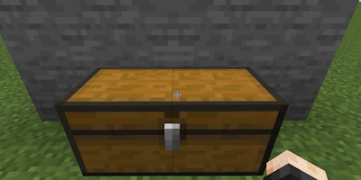

## 茶炉：

### 用法

小·茶炉

[//]: # ()

大·茶炉

[//]: # ()

* 步骤
  * 将一本书放到容器中第一格
  * 将一个消耗品扔在容器上方
  * 玩家距离消耗品5格之内

[茶方](/zh_cn/tea_room/tea_recipe.md)

### 容器

<table>
	<tablebody>
		<tr>
			<td>容器</td>
			<td>容器 ID</td>
			<td>物品位置</td>
		</tr>
		<tr>
            <td>木桶</td>
			<td>barrel</td>
			<td rowspan="4"></td>
		</tr>
		<tr>
            <td>潜影盒</td>
			<td>shulker_box</td>
		</tr>
		<tr>
            <td>箱子</td>
			<td>chest</td>
		</tr>
		<tr>
            <td>陷阱箱</td>
			<td>trapped_chest</td>
		</tr>
		<tr>
            <td>大箱子</td>
			<td>large_chest</td>
			<td></td>
		</tr>
		<tr>
            <td>漏斗</td>
			<td>hopper</td>
			<td></td>
		</tr>
		<tr>
            <td>投掷器</td>
			<td>dropper</td>
			<td rowspan="2"></td>
		</tr>
		<tr>
            <td>发射器</td>
			<td>dispenser</td>
		</tr>
		<tr>
            <td>熔炉</td>
			<td>furnace</td>
			<td rowspan="3"></td>
		</tr>
		<tr>
            <td>高炉</td>
			<td>blast_furnace</td>
		</tr>
		<tr>
            <td>烟熏炉</td>
			<td>smoker</td>
		</tr>
	</tablebody>
</table>

### 提示

* 检测空间顺序
  * 首先检测消耗品所在方块内的容器，如箱子、漏斗等不完整方块
  * 然后检查消耗品下方方块内的容器，如木桶、潜影盒等完整方块

* 检测时间顺序
  * 每间隔20ticks检测一次，对不同物品的检测是错峰的。

