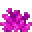

---
<!-- brain_coral__from__crafting_shaped__use__tag_coral.md -->

<!-- zh_tw -->

## 腦珊瑚 | 工作台：有序 | 珊瑚

<table>
	<tablebody>
		<tr>
			<td colspan="5">工作台：有序</td>
		</tr>
		<tr>
			<td></td>
			<td></td>
			<td></td>
			<td colspan="2"></td>
		</tr>
		<tr>
			<td></td>
			<td></td>
			<td></td>
			<td></td>
			<td></td>
		</tr>
		<tr>
			<td></td>
			<td></td>
			<td></td>
			<td colspan="2"></td>
		</tr>
	</tablebody>
</table>
<table>
	<tablebody>
		<tr>
			<td></td>
			<td>圖示</td>
			<td>名稱</td>
			<td>標簽</td>
			<td>數量</td>
		</tr>
		<tr>
			<td></td>
			<td></td>
			<td>腦珊瑚</td>
			<td>brain_coral</td>
			<td>8</td>
		</tr>
		<tr>
			<td></td>
			<td></td>
			<td><a>珊瑚</a></td>
			<td><a>coral</a></td>
			<td>8</td>
		</tr>
		<tr>
			<td></td>
			<td></td>
			<td>粉紅色染料</td>
			<td>pink_dye</td>
			<td>1</td>
		</tr>
	</tablebody>
</table>

[珊瑚](../../../zh_tw/tags/tag__coral.md)

---
<!-- bubble_coral__from__crafting_shaped__use__tag_coral.md -->

<!-- zh_tw -->

## 氣泡珊瑚 | 工作台：有序 | 珊瑚

<table>
	<tablebody>
		<tr>
			<td colspan="5">工作台：有序</td>
		</tr>
		<tr>
			<td></td>
			<td></td>
			<td></td>
			<td colspan="2"></td>
		</tr>
		<tr>
			<td></td>
			<td></td>
			<td></td>
			<td></td>
			<td></td>
		</tr>
		<tr>
			<td></td>
			<td></td>
			<td></td>
			<td colspan="2"></td>
		</tr>
	</tablebody>
</table>
<table>
	<tablebody>
		<tr>
			<td></td>
			<td>圖示</td>
			<td>名稱</td>
			<td>標簽</td>
			<td>數量</td>
		</tr>
		<tr>
			<td></td>
			<td></td>
			<td>氣泡珊瑚</td>
			<td>bubble_coral</td>
			<td>8</td>
		</tr>
		<tr>
			<td></td>
			<td></td>
			<td><a>珊瑚</a></td>
			<td><a>coral</a></td>
			<td>8</td>
		</tr>
		<tr>
			<td></td>
			<td></td>
			<td>紫色染料</td>
			<td>purple_dye</td>
			<td>1</td>
		</tr>
	</tablebody>
</table>

[珊瑚](../../../zh_tw/tags/tag__coral.md)

---
<!-- fire_coral__from__crafting_shaped__use__tag_coral.md -->

<!-- zh_tw -->

## 火珊瑚 | 工作台：有序 | 珊瑚

<table>
	<tablebody>
		<tr>
			<td colspan="5">工作台：有序</td>
		</tr>
		<tr>
			<td></td>
			<td></td>
			<td></td>
			<td colspan="2"></td>
		</tr>
		<tr>
			<td></td>
			<td></td>
			<td></td>
			<td></td>
			<td></td>
		</tr>
		<tr>
			<td></td>
			<td></td>
			<td></td>
			<td colspan="2"></td>
		</tr>
	</tablebody>
</table>
<table>
	<tablebody>
		<tr>
			<td></td>
			<td>圖示</td>
			<td>名稱</td>
			<td>標簽</td>
			<td>數量</td>
		</tr>
		<tr>
			<td></td>
			<td></td>
			<td>火珊瑚</td>
			<td>fire_coral</td>
			<td>8</td>
		</tr>
		<tr>
			<td></td>
			<td></td>
			<td><a>珊瑚</a></td>
			<td><a>coral</a></td>
			<td>8</td>
		</tr>
		<tr>
			<td></td>
			<td></td>
			<td>紅色染料</td>
			<td>red_dye</td>
			<td>1</td>
		</tr>
	</tablebody>
</table>

[珊瑚](../../../zh_tw/tags/tag__coral.md)

---
<!-- horn_coral__from__crafting_shaped__use__tag_coral.md -->

<!-- zh_tw -->

## 角珊瑚 | 工作台：有序 | 珊瑚

<table>
	<tablebody>
		<tr>
			<td colspan="5">工作台：有序</td>
		</tr>
		<tr>
			<td></td>
			<td></td>
			<td></td>
			<td colspan="2"></td>
		</tr>
		<tr>
			<td></td>
			<td></td>
			<td></td>
			<td></td>
			<td></td>
		</tr>
		<tr>
			<td></td>
			<td></td>
			<td></td>
			<td colspan="2"></td>
		</tr>
	</tablebody>
</table>
<table>
	<tablebody>
		<tr>
			<td></td>
			<td>圖示</td>
			<td>名稱</td>
			<td>標簽</td>
			<td>數量</td>
		</tr>
		<tr>
			<td></td>
			<td></td>
			<td>角珊瑚</td>
			<td>horn_coral</td>
			<td>8</td>
		</tr>
		<tr>
			<td></td>
			<td></td>
			<td><a>珊瑚</a></td>
			<td><a>coral</a></td>
			<td>8</td>
		</tr>
		<tr>
			<td></td>
			<td></td>
			<td>黃色染料</td>
			<td>yellow_dye</td>
			<td>1</td>
		</tr>
	</tablebody>
</table>

[珊瑚](../../../zh_tw/tags/tag__coral.md)

---
<!-- tube_coral__from__crafting_shaped__use__tag_coral.md -->

<!-- zh_tw -->

## 管珊瑚 | 工作台：有序 | 珊瑚

<table>
	<tablebody>
		<tr>
			<td colspan="5">工作台：有序</td>
		</tr>
		<tr>
			<td></td>
			<td></td>
			<td></td>
			<td colspan="2"></td>
		</tr>
		<tr>
			<td></td>
			<td></td>
			<td></td>
			<td></td>
			<td></td>
		</tr>
		<tr>
			<td></td>
			<td></td>
			<td></td>
			<td colspan="2"></td>
		</tr>
	</tablebody>
</table>
<table>
	<tablebody>
		<tr>
			<td></td>
			<td>圖示</td>
			<td>名稱</td>
			<td>標簽</td>
			<td>數量</td>
		</tr>
		<tr>
			<td></td>
			<td></td>
			<td>管珊瑚</td>
			<td>tube_coral</td>
			<td>8</td>
		</tr>
		<tr>
			<td></td>
			<td></td>
			<td><a>珊瑚</a></td>
			<td><a>coral</a></td>
			<td>8</td>
		</tr>
		<tr>
			<td></td>
			<td></td>
			<td>藍色染料</td>
			<td>blue_dye</td>
			<td>1</td>
		</tr>
	</tablebody>
</table>

[珊瑚](../../../zh_tw/tags/tag__coral.md)

