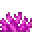
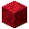
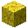
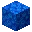

---
<!-- brain_coral_block__from__crafting_shaped__use__brain_coral.md -->

<!-- zh_tw -->

## 腦珊瑚方塊 | 工作台：有序 | 腦珊瑚

<table>
	<tablebody>
		<tr>
			<td colspan="5">工作台：有序</td>
		</tr>
		<tr>
			<td></td>
			<td></td>
			<td></td>
			<td colspan="2"></td>
		</tr>
		<tr>
			<td></td>
			<td></td>
			<td></td>
			<td></td>
			<td></td>
		</tr>
		<tr>
			<td></td>
			<td></td>
			<td></td>
			<td colspan="2"></td>
		</tr>
	</tablebody>
</table>
<table>
	<tablebody>
		<tr>
			<td></td>
			<td>圖示</td>
			<td>名稱</td>
			<td>標簽</td>
			<td>數量</td>
		</tr>
		<tr>
			<td></td>
			<td></td>
			<td>腦珊瑚方塊</td>
			<td>brain_coral_block</td>
			<td>1</td>
		</tr>
		<tr>
			<td rowspan="2"></td>
			<td></td>
			<td>腦珊瑚</td>
			<td>brain_coral</td>
			<td rowspan="2">9</td>
		</tr>
		<tr>
			<td></td>
			<td>扇狀腦珊瑚</td>
			<td>brain_coral_fan</td>
		</tr>
	</tablebody>
</table>

---
<!-- bubble_coral_block__from__crafting_shaped__use__bubble_coral.md -->

<!-- zh_tw -->

## 氣泡珊瑚方塊 | 工作台：有序 | 氣泡珊瑚

<table>
	<tablebody>
		<tr>
			<td colspan="5">工作台：有序</td>
		</tr>
		<tr>
			<td></td>
			<td></td>
			<td></td>
			<td colspan="2"></td>
		</tr>
		<tr>
			<td></td>
			<td></td>
			<td></td>
			<td></td>
			<td></td>
		</tr>
		<tr>
			<td></td>
			<td></td>
			<td></td>
			<td colspan="2"></td>
		</tr>
	</tablebody>
</table>
<table>
	<tablebody>
		<tr>
			<td></td>
			<td>圖示</td>
			<td>名稱</td>
			<td>標簽</td>
			<td>數量</td>
		</tr>
		<tr>
			<td></td>
			<td></td>
			<td>氣泡珊瑚方塊</td>
			<td>bubble_coral_block</td>
			<td>1</td>
		</tr>
		<tr>
			<td rowspan="2"></td>
			<td></td>
			<td>氣泡珊瑚</td>
			<td>bubble_coral</td>
			<td rowspan="2">9</td>
		</tr>
		<tr>
			<td></td>
			<td>扇狀氣泡珊瑚</td>
			<td>bubble_coral_fan</td>
		</tr>
	</tablebody>
</table>

---
<!-- fire_coral_block__from__crafting_shaped__use__fire_coral.md -->

<!-- zh_tw -->

## 火珊瑚方塊 | 工作台：有序 | 火珊瑚

<table>
	<tablebody>
		<tr>
			<td colspan="5">工作台：有序</td>
		</tr>
		<tr>
			<td></td>
			<td></td>
			<td></td>
			<td colspan="2"></td>
		</tr>
		<tr>
			<td></td>
			<td></td>
			<td></td>
			<td></td>
			<td></td>
		</tr>
		<tr>
			<td></td>
			<td></td>
			<td></td>
			<td colspan="2"></td>
		</tr>
	</tablebody>
</table>
<table>
	<tablebody>
		<tr>
			<td></td>
			<td>圖示</td>
			<td>名稱</td>
			<td>標簽</td>
			<td>數量</td>
		</tr>
		<tr>
			<td></td>
			<td></td>
			<td>火珊瑚方塊</td>
			<td>fire_coral_block</td>
			<td>1</td>
		</tr>
		<tr>
			<td rowspan="2"></td>
			<td></td>
			<td>火珊瑚</td>
			<td>fire_coral</td>
			<td rowspan="2">9</td>
		</tr>
		<tr>
			<td></td>
			<td>扇狀火珊瑚</td>
			<td>fire_coral_fan</td>
		</tr>
	</tablebody>
</table>

---
<!-- horn_coral_block__from__crafting_shaped__use__horn_coral.md -->

<!-- zh_tw -->

## 角珊瑚方塊 | 工作台：有序 | 角珊瑚

<table>
	<tablebody>
		<tr>
			<td colspan="5">工作台：有序</td>
		</tr>
		<tr>
			<td></td>
			<td></td>
			<td></td>
			<td colspan="2"></td>
		</tr>
		<tr>
			<td></td>
			<td></td>
			<td></td>
			<td></td>
			<td></td>
		</tr>
		<tr>
			<td></td>
			<td></td>
			<td></td>
			<td colspan="2"></td>
		</tr>
	</tablebody>
</table>
<table>
	<tablebody>
		<tr>
			<td></td>
			<td>圖示</td>
			<td>名稱</td>
			<td>標簽</td>
			<td>數量</td>
		</tr>
		<tr>
			<td></td>
			<td></td>
			<td>角珊瑚方塊</td>
			<td>horn_coral_block</td>
			<td>1</td>
		</tr>
		<tr>
			<td rowspan="2"></td>
			<td></td>
			<td>角珊瑚</td>
			<td>horn_coral</td>
			<td rowspan="2">9</td>
		</tr>
		<tr>
			<td></td>
			<td>扇狀角珊瑚</td>
			<td>horn_coral_fan</td>
		</tr>
	</tablebody>
</table>

---
<!-- tube_coral_block__from__crafting_shaped__use__tube_coral.md -->

<!-- zh_tw -->

## 管珊瑚方塊 | 工作台：有序 | 管珊瑚

<table>
	<tablebody>
		<tr>
			<td colspan="5">工作台：有序</td>
		</tr>
		<tr>
			<td></td>
			<td></td>
			<td></td>
			<td colspan="2"></td>
		</tr>
		<tr>
			<td></td>
			<td></td>
			<td></td>
			<td></td>
			<td></td>
		</tr>
		<tr>
			<td></td>
			<td></td>
			<td></td>
			<td colspan="2"></td>
		</tr>
	</tablebody>
</table>
<table>
	<tablebody>
		<tr>
			<td></td>
			<td>圖示</td>
			<td>名稱</td>
			<td>標簽</td>
			<td>數量</td>
		</tr>
		<tr>
			<td></td>
			<td></td>
			<td>管珊瑚方塊</td>
			<td>tube_coral_block</td>
			<td>1</td>
		</tr>
		<tr>
			<td rowspan="2"></td>
			<td></td>
			<td>管珊瑚</td>
			<td>tube_coral</td>
			<td rowspan="2">9</td>
		</tr>
		<tr>
			<td></td>
			<td>扇狀管珊瑚</td>
			<td>tube_coral_fan</td>
		</tr>
	</tablebody>
</table>

