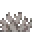
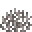
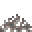

---
<!-- dead_brain_coral__from__crafting_shapeless__use__dead_brain_coral_fan.md -->

<!-- zh_tw -->

## 死亡的腦珊瑚 | 工作台：無序 | 死亡的扇狀腦珊瑚

<table>
	<tablebody>
		<tr>
			<td colspan="5">工作台：無序</td>
		</tr>
		<tr>
			<td></td>
			<td></td>
			<td></td>
			<td colspan="2"></td>
		</tr>
		<tr>
			<td></td>
			<td></td>
			<td></td>
			<td></td>
			<td></td>
		</tr>
		<tr>
			<td></td>
			<td></td>
			<td></td>
			<td colspan="2"></td>
		</tr>
	</tablebody>
</table>
<table>
	<tablebody>
		<tr>
			<td></td>
			<td>圖示</td>
			<td>名稱</td>
			<td>標簽</td>
			<td>數量</td>
		</tr>
		<tr>
			<td></td>
			<td></td>
			<td>死亡的腦珊瑚</td>
			<td>dead_brain_coral</td>
			<td>1</td>
		</tr>
		<tr>
			<td></td>
			<td></td>
			<td>死亡的扇狀腦珊瑚</td>
			<td>dead_brain_coral_fan</td>
			<td>1</td>
		</tr>
	</tablebody>
</table>

---
<!-- dead_bubble_coral__from__crafting_shapeless__use__dead_bubble_coral_fan.md -->

<!-- zh_tw -->

## 死亡的氣泡珊瑚 | 工作台：無序 | 死亡的扇狀氣泡珊瑚

<table>
	<tablebody>
		<tr>
			<td colspan="5">工作台：無序</td>
		</tr>
		<tr>
			<td></td>
			<td></td>
			<td></td>
			<td colspan="2"></td>
		</tr>
		<tr>
			<td></td>
			<td></td>
			<td></td>
			<td></td>
			<td></td>
		</tr>
		<tr>
			<td></td>
			<td></td>
			<td></td>
			<td colspan="2"></td>
		</tr>
	</tablebody>
</table>
<table>
	<tablebody>
		<tr>
			<td></td>
			<td>圖示</td>
			<td>名稱</td>
			<td>標簽</td>
			<td>數量</td>
		</tr>
		<tr>
			<td></td>
			<td></td>
			<td>死亡的氣泡珊瑚</td>
			<td>dead_bubble_coral</td>
			<td>1</td>
		</tr>
		<tr>
			<td></td>
			<td></td>
			<td>死亡的扇狀氣泡珊瑚</td>
			<td>dead_bubble_coral_fan</td>
			<td>1</td>
		</tr>
	</tablebody>
</table>

---
<!-- dead_fire_coral__from__crafting_shapeless__use__dead_fire_coral_fan.md -->

<!-- zh_tw -->

## 死亡的火珊瑚 | 工作台：無序 | 死亡的扇狀火珊瑚

<table>
	<tablebody>
		<tr>
			<td colspan="5">工作台：無序</td>
		</tr>
		<tr>
			<td></td>
			<td></td>
			<td></td>
			<td colspan="2"></td>
		</tr>
		<tr>
			<td></td>
			<td></td>
			<td></td>
			<td></td>
			<td></td>
		</tr>
		<tr>
			<td></td>
			<td></td>
			<td></td>
			<td colspan="2"></td>
		</tr>
	</tablebody>
</table>
<table>
	<tablebody>
		<tr>
			<td></td>
			<td>圖示</td>
			<td>名稱</td>
			<td>標簽</td>
			<td>數量</td>
		</tr>
		<tr>
			<td></td>
			<td></td>
			<td>死亡的火珊瑚</td>
			<td>dead_fire_coral</td>
			<td>1</td>
		</tr>
		<tr>
			<td></td>
			<td></td>
			<td>死亡的扇狀火珊瑚</td>
			<td>dead_fire_coral_fan</td>
			<td>1</td>
		</tr>
	</tablebody>
</table>

---
<!-- dead_horn_coral__from__crafting_shapeless__use__dead_horn_coral_fan.md -->

<!-- zh_tw -->

## 死亡的角珊瑚 | 工作台：無序 | 死亡的扇狀角珊瑚

<table>
	<tablebody>
		<tr>
			<td colspan="5">工作台：無序</td>
		</tr>
		<tr>
			<td></td>
			<td></td>
			<td></td>
			<td colspan="2"></td>
		</tr>
		<tr>
			<td></td>
			<td></td>
			<td></td>
			<td></td>
			<td></td>
		</tr>
		<tr>
			<td></td>
			<td></td>
			<td></td>
			<td colspan="2"></td>
		</tr>
	</tablebody>
</table>
<table>
	<tablebody>
		<tr>
			<td></td>
			<td>圖示</td>
			<td>名稱</td>
			<td>標簽</td>
			<td>數量</td>
		</tr>
		<tr>
			<td></td>
			<td></td>
			<td>死亡的角珊瑚</td>
			<td>dead_horn_coral</td>
			<td>1</td>
		</tr>
		<tr>
			<td></td>
			<td></td>
			<td>死亡的扇狀角珊瑚</td>
			<td>dead_horn_coral_fan</td>
			<td>1</td>
		</tr>
	</tablebody>
</table>

---
<!-- dead_tube_coral__from__crafting_shapeless__use__dead_tube_coral_fan.md -->

<!-- zh_tw -->

## 死亡的管珊瑚 | 工作台：無序 | 死亡的扇狀管珊瑚

<table>
	<tablebody>
		<tr>
			<td colspan="5">工作台：無序</td>
		</tr>
		<tr>
			<td></td>
			<td></td>
			<td></td>
			<td colspan="2"></td>
		</tr>
		<tr>
			<td></td>
			<td></td>
			<td></td>
			<td></td>
			<td></td>
		</tr>
		<tr>
			<td></td>
			<td></td>
			<td></td>
			<td colspan="2"></td>
		</tr>
	</tablebody>
</table>
<table>
	<tablebody>
		<tr>
			<td></td>
			<td>圖示</td>
			<td>名稱</td>
			<td>標簽</td>
			<td>數量</td>
		</tr>
		<tr>
			<td></td>
			<td></td>
			<td>死亡的管珊瑚</td>
			<td>dead_tube_coral</td>
			<td>1</td>
		</tr>
		<tr>
			<td></td>
			<td></td>
			<td>死亡的扇狀管珊瑚</td>
			<td>dead_tube_coral_fan</td>
			<td>1</td>
		</tr>
	</tablebody>
</table>

