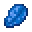

---
<!-- lapis_lazuli__from__crafting_shaped__use__quartz.md -->

<!-- zh_tw -->

## 青金石 | 工作台：有序 | 地獄石英

<table>
	<tablebody>
		<tr>
			<td colspan="5">工作台：有序</td>
		</tr>
		<tr>
			<td></td>
			<td></td>
			<td></td>
			<td colspan="2"></td>
		</tr>
		<tr>
			<td></td>
			<td></td>
			<td></td>
			<td></td>
			<td></td>
		</tr>
		<tr>
			<td></td>
			<td></td>
			<td></td>
			<td colspan="2"></td>
		</tr>
	</tablebody>
</table>
<table>
	<tablebody>
		<tr>
			<td></td>
			<td>圖示</td>
			<td>名稱</td>
			<td>標簽</td>
			<td>數量</td>
		</tr>
		<tr>
			<td></td>
			<td></td>
			<td>青金石</td>
			<td>lapis_lazuli</td>
			<td>1</td>
		</tr>
		<tr>
			<td></td>
			<td></td>
			<td>地獄石英</td>
			<td>quartz</td>
			<td>5</td>
		</tr>
	</tablebody>
</table>

---
<!-- quartz__from__crafting_shapeless__use__lapis_lazuli.md -->

<!-- zh_tw -->

## 地獄石英 | 工作台：無序 | 青金石

<table>
	<tablebody>
		<tr>
			<td colspan="5">工作台：無序</td>
		</tr>
		<tr>
			<td></td>
			<td></td>
			<td></td>
			<td colspan="2"></td>
		</tr>
		<tr>
			<td></td>
			<td></td>
			<td></td>
			<td></td>
			<td></td>
		</tr>
		<tr>
			<td></td>
			<td></td>
			<td></td>
			<td colspan="2"></td>
		</tr>
	</tablebody>
</table>
<table>
	<tablebody>
		<tr>
			<td></td>
			<td>圖示</td>
			<td>名稱</td>
			<td>標簽</td>
			<td>數量</td>
		</tr>
		<tr>
			<td></td>
			<td></td>
			<td>地獄石英</td>
			<td>quartz</td>
			<td>10</td>
		</tr>
		<tr>
			<td></td>
			<td></td>
			<td>青金石</td>
			<td>lapis_lazuli</td>
			<td>1</td>
		</tr>
		<tr>
			<td></td>
			<td></td>
			<td>青金石</td>
			<td>lapis_lazuli</td>
			<td>1</td>
		</tr>
	</tablebody>
</table>

