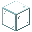
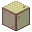

---
<!-- glass__from__crafting_shapeless__use__tag_stained_glass.md -->

<!-- zh_tw -->

## 玻璃 | 工作台：無序 | 彩色玻璃

<table>
	<tablebody>
		<tr>
			<td colspan="5">工作台：無序</td>
		</tr>
		<tr>
			<td></td>
			<td></td>
			<td></td>
			<td colspan="2"></td>
		</tr>
		<tr>
			<td></td>
			<td></td>
			<td></td>
			<td></td>
			<td></td>
		</tr>
		<tr>
			<td></td>
			<td></td>
			<td></td>
			<td colspan="2"></td>
		</tr>
	</tablebody>
</table>
<table>
	<tablebody>
		<tr>
			<td></td>
			<td>圖示</td>
			<td>名稱</td>
			<td>標簽</td>
			<td>數量</td>
		</tr>
		<tr>
			<td></td>
			<td></td>
			<td>玻璃</td>
			<td>glass</td>
			<td>1</td>
		</tr>
		<tr>
			<td></td>
			<td></td>
			<td><a>彩色玻璃</a></td>
			<td><a>stained_glass</a></td>
			<td>1</td>
		</tr>
	</tablebody>
</table>

[彩色玻璃](../../../zh_tw/tags/tag__stained_glass.md)

---
<!-- black_stained_glass__from__crafting_shapeless__use__tag_stained_glass.md -->

<!-- zh_tw -->

## 黑色玻璃 | 工作台：無序 | 彩色玻璃

<table>
	<tablebody>
		<tr>
			<td colspan="5">工作台：無序</td>
		</tr>
		<tr>
			<td></td>
			<td></td>
			<td></td>
			<td colspan="2"></td>
		</tr>
		<tr>
			<td></td>
			<td></td>
			<td></td>
			<td></td>
			<td></td>
		</tr>
		<tr>
			<td></td>
			<td></td>
			<td></td>
			<td colspan="2"></td>
		</tr>
	</tablebody>
</table>
<table>
	<tablebody>
		<tr>
			<td></td>
			<td>圖示</td>
			<td>名稱</td>
			<td>標簽</td>
			<td>數量</td>
		</tr>
		<tr>
			<td></td>
			<td></td>
			<td>黑色玻璃</td>
			<td>black_stained_glass</td>
			<td>1</td>
		</tr>
		<tr>
			<td rowspan="2"></td>
			<td></td>
			<td><a>彩色玻璃</a></td>
			<td><a>stained_glass</a></td>
			<td rowspan="2">1</td>
		</tr>
		<tr>
			<td></td>
			<td>玻璃</td>
			<td>glass</td>
		</tr>
		<tr>
			<td></td>
			<td></td>
			<td>黑色染料</td>
			<td>black_dye</td>
			<td>1</td>
		</tr>
	</tablebody>
</table>

[彩色玻璃](../../../zh_tw/tags/tag__stained_glass.md)

---
<!-- blue_stained_glass__from__crafting_shapeless__use__tag_stained_glass.md -->

<!-- zh_tw -->

## 藍色玻璃 | 工作台：無序 | 彩色玻璃

<table>
	<tablebody>
		<tr>
			<td colspan="5">工作台：無序</td>
		</tr>
		<tr>
			<td></td>
			<td></td>
			<td></td>
			<td colspan="2"></td>
		</tr>
		<tr>
			<td></td>
			<td></td>
			<td></td>
			<td></td>
			<td></td>
		</tr>
		<tr>
			<td></td>
			<td></td>
			<td></td>
			<td colspan="2"></td>
		</tr>
	</tablebody>
</table>
<table>
	<tablebody>
		<tr>
			<td></td>
			<td>圖示</td>
			<td>名稱</td>
			<td>標簽</td>
			<td>數量</td>
		</tr>
		<tr>
			<td></td>
			<td></td>
			<td>藍色玻璃</td>
			<td>blue_stained_glass</td>
			<td>1</td>
		</tr>
		<tr>
			<td rowspan="2"></td>
			<td></td>
			<td><a>彩色玻璃</a></td>
			<td><a>stained_glass</a></td>
			<td rowspan="2">1</td>
		</tr>
		<tr>
			<td></td>
			<td>玻璃</td>
			<td>glass</td>
		</tr>
		<tr>
			<td></td>
			<td></td>
			<td>藍色染料</td>
			<td>blue_dye</td>
			<td>1</td>
		</tr>
	</tablebody>
</table>

[彩色玻璃](../../../zh_tw/tags/tag__stained_glass.md)

---
<!-- brown_stained_glass__from__crafting_shapeless__use__tag_stained_glass.md -->

<!-- zh_tw -->

## 棕色玻璃 | 工作台：無序 | 彩色玻璃

<table>
	<tablebody>
		<tr>
			<td colspan="5">工作台：無序</td>
		</tr>
		<tr>
			<td></td>
			<td></td>
			<td></td>
			<td colspan="2"></td>
		</tr>
		<tr>
			<td></td>
			<td></td>
			<td></td>
			<td></td>
			<td></td>
		</tr>
		<tr>
			<td></td>
			<td></td>
			<td></td>
			<td colspan="2"></td>
		</tr>
	</tablebody>
</table>
<table>
	<tablebody>
		<tr>
			<td></td>
			<td>圖示</td>
			<td>名稱</td>
			<td>標簽</td>
			<td>數量</td>
		</tr>
		<tr>
			<td></td>
			<td></td>
			<td>棕色玻璃</td>
			<td>brown_stained_glass</td>
			<td>1</td>
		</tr>
		<tr>
			<td rowspan="2"></td>
			<td></td>
			<td><a>彩色玻璃</a></td>
			<td><a>stained_glass</a></td>
			<td rowspan="2">1</td>
		</tr>
		<tr>
			<td></td>
			<td>玻璃</td>
			<td>glass</td>
		</tr>
		<tr>
			<td></td>
			<td></td>
			<td>棕色染料</td>
			<td>brown_dye</td>
			<td>1</td>
		</tr>
	</tablebody>
</table>

[彩色玻璃](../../../zh_tw/tags/tag__stained_glass.md)

---
<!-- cyan_stained_glass__from__crafting_shapeless__use__tag_stained_glass.md -->

<!-- zh_tw -->

## 青色玻璃 | 工作台：無序 | 彩色玻璃

<table>
	<tablebody>
		<tr>
			<td colspan="5">工作台：無序</td>
		</tr>
		<tr>
			<td></td>
			<td></td>
			<td></td>
			<td colspan="2"></td>
		</tr>
		<tr>
			<td></td>
			<td></td>
			<td></td>
			<td></td>
			<td></td>
		</tr>
		<tr>
			<td></td>
			<td></td>
			<td></td>
			<td colspan="2"></td>
		</tr>
	</tablebody>
</table>
<table>
	<tablebody>
		<tr>
			<td></td>
			<td>圖示</td>
			<td>名稱</td>
			<td>標簽</td>
			<td>數量</td>
		</tr>
		<tr>
			<td></td>
			<td></td>
			<td>青色玻璃</td>
			<td>cyan_stained_glass</td>
			<td>1</td>
		</tr>
		<tr>
			<td rowspan="2"></td>
			<td></td>
			<td><a>彩色玻璃</a></td>
			<td><a>stained_glass</a></td>
			<td rowspan="2">1</td>
		</tr>
		<tr>
			<td></td>
			<td>玻璃</td>
			<td>glass</td>
		</tr>
		<tr>
			<td></td>
			<td></td>
			<td>青色染料</td>
			<td>cyan_dye</td>
			<td>1</td>
		</tr>
	</tablebody>
</table>

[彩色玻璃](../../../zh_tw/tags/tag__stained_glass.md)

---
<!-- gray_stained_glass__from__crafting_shapeless__use__tag_stained_glass.md -->

<!-- zh_tw -->

## 灰色玻璃 | 工作台：無序 | 彩色玻璃

<table>
	<tablebody>
		<tr>
			<td colspan="5">工作台：無序</td>
		</tr>
		<tr>
			<td></td>
			<td></td>
			<td></td>
			<td colspan="2"></td>
		</tr>
		<tr>
			<td></td>
			<td></td>
			<td></td>
			<td></td>
			<td></td>
		</tr>
		<tr>
			<td></td>
			<td></td>
			<td></td>
			<td colspan="2"></td>
		</tr>
	</tablebody>
</table>
<table>
	<tablebody>
		<tr>
			<td></td>
			<td>圖示</td>
			<td>名稱</td>
			<td>標簽</td>
			<td>數量</td>
		</tr>
		<tr>
			<td></td>
			<td></td>
			<td>灰色玻璃</td>
			<td>gray_stained_glass</td>
			<td>1</td>
		</tr>
		<tr>
			<td rowspan="2"></td>
			<td></td>
			<td><a>彩色玻璃</a></td>
			<td><a>stained_glass</a></td>
			<td rowspan="2">1</td>
		</tr>
		<tr>
			<td></td>
			<td>玻璃</td>
			<td>glass</td>
		</tr>
		<tr>
			<td></td>
			<td></td>
			<td>灰色染料</td>
			<td>gray_dye</td>
			<td>1</td>
		</tr>
	</tablebody>
</table>

[彩色玻璃](../../../zh_tw/tags/tag__stained_glass.md)

---
<!-- green_stained_glass__from__crafting_shapeless__use__tag_stained_glass.md -->

<!-- zh_tw -->

## 綠色玻璃 | 工作台：無序 | 彩色玻璃

<table>
	<tablebody>
		<tr>
			<td colspan="5">工作台：無序</td>
		</tr>
		<tr>
			<td></td>
			<td></td>
			<td></td>
			<td colspan="2"></td>
		</tr>
		<tr>
			<td></td>
			<td></td>
			<td></td>
			<td></td>
			<td></td>
		</tr>
		<tr>
			<td></td>
			<td></td>
			<td></td>
			<td colspan="2"></td>
		</tr>
	</tablebody>
</table>
<table>
	<tablebody>
		<tr>
			<td></td>
			<td>圖示</td>
			<td>名稱</td>
			<td>標簽</td>
			<td>數量</td>
		</tr>
		<tr>
			<td></td>
			<td></td>
			<td>綠色玻璃</td>
			<td>green_stained_glass</td>
			<td>1</td>
		</tr>
		<tr>
			<td rowspan="2"></td>
			<td></td>
			<td><a>彩色玻璃</a></td>
			<td><a>stained_glass</a></td>
			<td rowspan="2">1</td>
		</tr>
		<tr>
			<td></td>
			<td>玻璃</td>
			<td>glass</td>
		</tr>
		<tr>
			<td></td>
			<td></td>
			<td>綠色染料</td>
			<td>green_dye</td>
			<td>1</td>
		</tr>
	</tablebody>
</table>

[彩色玻璃](../../../zh_tw/tags/tag__stained_glass.md)

---
<!-- light_blue_stained_glass__from__crafting_shapeless__use__tag_stained_glass.md -->

<!-- zh_tw -->

## 淺藍色玻璃 | 工作台：無序 | 彩色玻璃

<table>
	<tablebody>
		<tr>
			<td colspan="5">工作台：無序</td>
		</tr>
		<tr>
			<td></td>
			<td></td>
			<td></td>
			<td colspan="2"></td>
		</tr>
		<tr>
			<td></td>
			<td></td>
			<td></td>
			<td></td>
			<td></td>
		</tr>
		<tr>
			<td></td>
			<td></td>
			<td></td>
			<td colspan="2"></td>
		</tr>
	</tablebody>
</table>
<table>
	<tablebody>
		<tr>
			<td></td>
			<td>圖示</td>
			<td>名稱</td>
			<td>標簽</td>
			<td>數量</td>
		</tr>
		<tr>
			<td></td>
			<td></td>
			<td>淺藍色玻璃</td>
			<td>light_blue_stained_glass</td>
			<td>1</td>
		</tr>
		<tr>
			<td rowspan="2"></td>
			<td></td>
			<td><a>彩色玻璃</a></td>
			<td><a>stained_glass</a></td>
			<td rowspan="2">1</td>
		</tr>
		<tr>
			<td></td>
			<td>玻璃</td>
			<td>glass</td>
		</tr>
		<tr>
			<td></td>
			<td></td>
			<td>淺藍色染料</td>
			<td>light_blue_dye</td>
			<td>1</td>
		</tr>
	</tablebody>
</table>

[彩色玻璃](../../../zh_tw/tags/tag__stained_glass.md)

---
<!-- light_gray_stained_glass__from__crafting_shapeless__use__tag_stained_glass.md -->

<!-- zh_tw -->

## 淺灰色玻璃 | 工作台：無序 | 彩色玻璃

<table>
	<tablebody>
		<tr>
			<td colspan="5">工作台：無序</td>
		</tr>
		<tr>
			<td></td>
			<td></td>
			<td></td>
			<td colspan="2"></td>
		</tr>
		<tr>
			<td></td>
			<td></td>
			<td></td>
			<td></td>
			<td></td>
		</tr>
		<tr>
			<td></td>
			<td></td>
			<td></td>
			<td colspan="2"></td>
		</tr>
	</tablebody>
</table>
<table>
	<tablebody>
		<tr>
			<td></td>
			<td>圖示</td>
			<td>名稱</td>
			<td>標簽</td>
			<td>數量</td>
		</tr>
		<tr>
			<td></td>
			<td></td>
			<td>淺灰色玻璃</td>
			<td>light_gray_stained_glass</td>
			<td>1</td>
		</tr>
		<tr>
			<td rowspan="2"></td>
			<td></td>
			<td><a>彩色玻璃</a></td>
			<td><a>stained_glass</a></td>
			<td rowspan="2">1</td>
		</tr>
		<tr>
			<td></td>
			<td>玻璃</td>
			<td>glass</td>
		</tr>
		<tr>
			<td></td>
			<td></td>
			<td>淺灰色染料</td>
			<td>light_gray_dye</td>
			<td>1</td>
		</tr>
	</tablebody>
</table>

[彩色玻璃](../../../zh_tw/tags/tag__stained_glass.md)

---
<!-- lime_stained_glass__from__crafting_shapeless__use__tag_stained_glass.md -->

<!-- zh_tw -->

## 淺綠色玻璃 | 工作台：無序 | 彩色玻璃

<table>
	<tablebody>
		<tr>
			<td colspan="5">工作台：無序</td>
		</tr>
		<tr>
			<td></td>
			<td></td>
			<td></td>
			<td colspan="2"></td>
		</tr>
		<tr>
			<td></td>
			<td></td>
			<td></td>
			<td></td>
			<td></td>
		</tr>
		<tr>
			<td></td>
			<td></td>
			<td></td>
			<td colspan="2"></td>
		</tr>
	</tablebody>
</table>
<table>
	<tablebody>
		<tr>
			<td></td>
			<td>圖示</td>
			<td>名稱</td>
			<td>標簽</td>
			<td>數量</td>
		</tr>
		<tr>
			<td></td>
			<td></td>
			<td>淺綠色玻璃</td>
			<td>lime_stained_glass</td>
			<td>1</td>
		</tr>
		<tr>
			<td rowspan="2"></td>
			<td></td>
			<td><a>彩色玻璃</a></td>
			<td><a>stained_glass</a></td>
			<td rowspan="2">1</td>
		</tr>
		<tr>
			<td></td>
			<td>玻璃</td>
			<td>glass</td>
		</tr>
		<tr>
			<td></td>
			<td></td>
			<td>淺綠色染料</td>
			<td>lime_dye</td>
			<td>1</td>
		</tr>
	</tablebody>
</table>

[彩色玻璃](../../../zh_tw/tags/tag__stained_glass.md)

---
<!-- magenta_stained_glass__from__crafting_shapeless__use__tag_stained_glass.md -->

<!-- zh_tw -->

## 洋紅色玻璃 | 工作台：無序 | 彩色玻璃

<table>
	<tablebody>
		<tr>
			<td colspan="5">工作台：無序</td>
		</tr>
		<tr>
			<td></td>
			<td></td>
			<td></td>
			<td colspan="2"></td>
		</tr>
		<tr>
			<td></td>
			<td></td>
			<td></td>
			<td></td>
			<td></td>
		</tr>
		<tr>
			<td></td>
			<td></td>
			<td></td>
			<td colspan="2"></td>
		</tr>
	</tablebody>
</table>
<table>
	<tablebody>
		<tr>
			<td></td>
			<td>圖示</td>
			<td>名稱</td>
			<td>標簽</td>
			<td>數量</td>
		</tr>
		<tr>
			<td></td>
			<td></td>
			<td>洋紅色玻璃</td>
			<td>magenta_stained_glass</td>
			<td>1</td>
		</tr>
		<tr>
			<td rowspan="2"></td>
			<td></td>
			<td><a>彩色玻璃</a></td>
			<td><a>stained_glass</a></td>
			<td rowspan="2">1</td>
		</tr>
		<tr>
			<td></td>
			<td>玻璃</td>
			<td>glass</td>
		</tr>
		<tr>
			<td></td>
			<td></td>
			<td>洋紅色染料</td>
			<td>magenta_dye</td>
			<td>1</td>
		</tr>
	</tablebody>
</table>

[彩色玻璃](../../../zh_tw/tags/tag__stained_glass.md)

---
<!-- orange_stained_glass__from__crafting_shapeless__use__tag_stained_glass.md -->

<!-- zh_tw -->

## 橙色玻璃 | 工作台：無序 | 彩色玻璃

<table>
	<tablebody>
		<tr>
			<td colspan="5">工作台：無序</td>
		</tr>
		<tr>
			<td></td>
			<td></td>
			<td></td>
			<td colspan="2"></td>
		</tr>
		<tr>
			<td></td>
			<td></td>
			<td></td>
			<td></td>
			<td></td>
		</tr>
		<tr>
			<td></td>
			<td></td>
			<td></td>
			<td colspan="2"></td>
		</tr>
	</tablebody>
</table>
<table>
	<tablebody>
		<tr>
			<td></td>
			<td>圖示</td>
			<td>名稱</td>
			<td>標簽</td>
			<td>數量</td>
		</tr>
		<tr>
			<td></td>
			<td></td>
			<td>橙色玻璃</td>
			<td>orange_stained_glass</td>
			<td>1</td>
		</tr>
		<tr>
			<td rowspan="2"></td>
			<td></td>
			<td><a>彩色玻璃</a></td>
			<td><a>stained_glass</a></td>
			<td rowspan="2">1</td>
		</tr>
		<tr>
			<td></td>
			<td>玻璃</td>
			<td>glass</td>
		</tr>
		<tr>
			<td></td>
			<td></td>
			<td>橙色染料</td>
			<td>orange_dye</td>
			<td>1</td>
		</tr>
	</tablebody>
</table>

[彩色玻璃](../../../zh_tw/tags/tag__stained_glass.md)

---
<!-- pink_stained_glass__from__crafting_shapeless__use__tag_stained_glass.md -->

<!-- zh_tw -->

## 粉紅色玻璃 | 工作台：無序 | 彩色玻璃

<table>
	<tablebody>
		<tr>
			<td colspan="5">工作台：無序</td>
		</tr>
		<tr>
			<td></td>
			<td></td>
			<td></td>
			<td colspan="2"></td>
		</tr>
		<tr>
			<td></td>
			<td></td>
			<td></td>
			<td></td>
			<td></td>
		</tr>
		<tr>
			<td></td>
			<td></td>
			<td></td>
			<td colspan="2"></td>
		</tr>
	</tablebody>
</table>
<table>
	<tablebody>
		<tr>
			<td></td>
			<td>圖示</td>
			<td>名稱</td>
			<td>標簽</td>
			<td>數量</td>
		</tr>
		<tr>
			<td></td>
			<td></td>
			<td>粉紅色玻璃</td>
			<td>pink_stained_glass</td>
			<td>1</td>
		</tr>
		<tr>
			<td rowspan="2"></td>
			<td></td>
			<td><a>彩色玻璃</a></td>
			<td><a>stained_glass</a></td>
			<td rowspan="2">1</td>
		</tr>
		<tr>
			<td></td>
			<td>玻璃</td>
			<td>glass</td>
		</tr>
		<tr>
			<td></td>
			<td></td>
			<td>粉紅色染料</td>
			<td>pink_dye</td>
			<td>1</td>
		</tr>
	</tablebody>
</table>

[彩色玻璃](../../../zh_tw/tags/tag__stained_glass.md)

---
<!-- purple_stained_glass__from__crafting_shapeless__use__tag_stained_glass.md -->

<!-- zh_tw -->

## 紫色玻璃 | 工作台：無序 | 彩色玻璃

<table>
	<tablebody>
		<tr>
			<td colspan="5">工作台：無序</td>
		</tr>
		<tr>
			<td></td>
			<td></td>
			<td></td>
			<td colspan="2"></td>
		</tr>
		<tr>
			<td></td>
			<td></td>
			<td></td>
			<td></td>
			<td></td>
		</tr>
		<tr>
			<td></td>
			<td></td>
			<td></td>
			<td colspan="2"></td>
		</tr>
	</tablebody>
</table>
<table>
	<tablebody>
		<tr>
			<td></td>
			<td>圖示</td>
			<td>名稱</td>
			<td>標簽</td>
			<td>數量</td>
		</tr>
		<tr>
			<td></td>
			<td></td>
			<td>紫色玻璃</td>
			<td>purple_stained_glass</td>
			<td>1</td>
		</tr>
		<tr>
			<td rowspan="2"></td>
			<td></td>
			<td><a>彩色玻璃</a></td>
			<td><a>stained_glass</a></td>
			<td rowspan="2">1</td>
		</tr>
		<tr>
			<td></td>
			<td>玻璃</td>
			<td>glass</td>
		</tr>
		<tr>
			<td></td>
			<td></td>
			<td>紫色染料</td>
			<td>purple_dye</td>
			<td>1</td>
		</tr>
	</tablebody>
</table>

[彩色玻璃](../../../zh_tw/tags/tag__stained_glass.md)

---
<!-- red_stained_glass__from__crafting_shapeless__use__tag_stained_glass.md -->

<!-- zh_tw -->

## 紅色玻璃 | 工作台：無序 | 彩色玻璃

<table>
	<tablebody>
		<tr>
			<td colspan="5">工作台：無序</td>
		</tr>
		<tr>
			<td></td>
			<td></td>
			<td></td>
			<td colspan="2"></td>
		</tr>
		<tr>
			<td></td>
			<td></td>
			<td></td>
			<td></td>
			<td></td>
		</tr>
		<tr>
			<td></td>
			<td></td>
			<td></td>
			<td colspan="2"></td>
		</tr>
	</tablebody>
</table>
<table>
	<tablebody>
		<tr>
			<td></td>
			<td>圖示</td>
			<td>名稱</td>
			<td>標簽</td>
			<td>數量</td>
		</tr>
		<tr>
			<td></td>
			<td></td>
			<td>紅色玻璃</td>
			<td>red_stained_glass</td>
			<td>1</td>
		</tr>
		<tr>
			<td rowspan="2"></td>
			<td></td>
			<td><a>彩色玻璃</a></td>
			<td><a>stained_glass</a></td>
			<td rowspan="2">1</td>
		</tr>
		<tr>
			<td></td>
			<td>玻璃</td>
			<td>glass</td>
		</tr>
		<tr>
			<td></td>
			<td></td>
			<td>紅色染料</td>
			<td>red_dye</td>
			<td>1</td>
		</tr>
	</tablebody>
</table>

[彩色玻璃](../../../zh_tw/tags/tag__stained_glass.md)

---
<!-- white_stained_glass__from__crafting_shapeless__use__tag_stained_glass.md -->

<!-- zh_tw -->

## 白色玻璃 | 工作台：無序 | 彩色玻璃

<table>
	<tablebody>
		<tr>
			<td colspan="5">工作台：無序</td>
		</tr>
		<tr>
			<td></td>
			<td></td>
			<td></td>
			<td colspan="2"></td>
		</tr>
		<tr>
			<td></td>
			<td></td>
			<td></td>
			<td></td>
			<td></td>
		</tr>
		<tr>
			<td></td>
			<td></td>
			<td></td>
			<td colspan="2"></td>
		</tr>
	</tablebody>
</table>
<table>
	<tablebody>
		<tr>
			<td></td>
			<td>圖示</td>
			<td>名稱</td>
			<td>標簽</td>
			<td>數量</td>
		</tr>
		<tr>
			<td></td>
			<td></td>
			<td>白色玻璃</td>
			<td>white_stained_glass</td>
			<td>1</td>
		</tr>
		<tr>
			<td rowspan="2"></td>
			<td></td>
			<td><a>彩色玻璃</a></td>
			<td><a>stained_glass</a></td>
			<td rowspan="2">1</td>
		</tr>
		<tr>
			<td></td>
			<td>玻璃</td>
			<td>glass</td>
		</tr>
		<tr>
			<td></td>
			<td></td>
			<td>白色染料</td>
			<td>white_dye</td>
			<td>1</td>
		</tr>
	</tablebody>
</table>

[彩色玻璃](../../../zh_tw/tags/tag__stained_glass.md)

---
<!-- yellow_stained_glass__from__crafting_shapeless__use__tag_stained_glass.md -->

<!-- zh_tw -->

## 黃色玻璃 | 工作台：無序 | 彩色玻璃

<table>
	<tablebody>
		<tr>
			<td colspan="5">工作台：無序</td>
		</tr>
		<tr>
			<td></td>
			<td></td>
			<td></td>
			<td colspan="2"></td>
		</tr>
		<tr>
			<td></td>
			<td></td>
			<td></td>
			<td></td>
			<td></td>
		</tr>
		<tr>
			<td></td>
			<td></td>
			<td></td>
			<td colspan="2"></td>
		</tr>
	</tablebody>
</table>
<table>
	<tablebody>
		<tr>
			<td></td>
			<td>圖示</td>
			<td>名稱</td>
			<td>標簽</td>
			<td>數量</td>
		</tr>
		<tr>
			<td></td>
			<td></td>
			<td>黃色玻璃</td>
			<td>yellow_stained_glass</td>
			<td>1</td>
		</tr>
		<tr>
			<td rowspan="2"></td>
			<td></td>
			<td><a>彩色玻璃</a></td>
			<td><a>stained_glass</a></td>
			<td rowspan="2">1</td>
		</tr>
		<tr>
			<td></td>
			<td>玻璃</td>
			<td>glass</td>
		</tr>
		<tr>
			<td></td>
			<td></td>
			<td>黃色染料</td>
			<td>yellow_dye</td>
			<td>1</td>
		</tr>
	</tablebody>
</table>

[彩色玻璃](../../../zh_tw/tags/tag__stained_glass.md)

