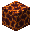

---
<!-- magma_cream__from__crafting_shapeless__use__magma_block.md -->

<!-- zh_tw -->

## 岩漿球 | 工作台：無序 | 岩漿塊

<table>
	<tablebody>
		<tr>
			<td colspan="5">工作台：無序</td>
		</tr>
		<tr>
			<td></td>
			<td></td>
			<td></td>
			<td colspan="2"></td>
		</tr>
		<tr>
			<td></td>
			<td></td>
			<td></td>
			<td></td>
			<td></td>
		</tr>
		<tr>
			<td></td>
			<td></td>
			<td></td>
			<td colspan="2"></td>
		</tr>
	</tablebody>
</table>
<table>
	<tablebody>
		<tr>
			<td></td>
			<td>圖示</td>
			<td>名稱</td>
			<td>標簽</td>
			<td>數量</td>
		</tr>
		<tr>
			<td></td>
			<td></td>
			<td>岩漿球</td>
			<td>magma_cream</td>
			<td>4</td>
		</tr>
		<tr>
			<td></td>
			<td></td>
			<td>岩漿塊</td>
			<td>magma_block</td>
			<td>1</td>
		</tr>
	</tablebody>
</table>

