---
<!-- copper_block__from__blasting__use__copper_ore.md -->

<!-- zh_tw -->

## 銅方塊 | 高爐 | 銅礦

<table>
	<tablebody>
		<tr>
			<td colspan="3">高爐</td>
			<td>時長</td>
			<td>經驗</td>
		</tr>
		<tr>
			<td>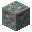</td>
			<td></td>
			<td>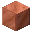</td>
			<td>100</td>
			<td>7</td>
		</tr>
	</tablebody>
</table>
<table>
	<tablebody>
		<tr>
			<td></td>
			<td>圖示</td>
			<td>名稱</td>
			<td>標簽</td>
			<td>數量</td>
		</tr>
		<tr>
			<td></td>
			<td></td>
			<td>銅礦</td>
			<td>copper_ore</td>
			<td>1</td>
		</tr>
		<tr>
			<td></td>
			<td></td>
			<td>銅方塊</td>
			<td>copper_block</td>
			<td>1</td>
		</tr>
	</tablebody>
</table>

---
<!-- copper_block__from__blasting__use__deepslate_copper_ore.md -->

<!-- zh_tw -->

## 銅方塊 | 高爐 | 深板岩銅礦

<table>
	<tablebody>
		<tr>
			<td colspan="3">高爐</td>
			<td>時長</td>
			<td>經驗</td>
		</tr>
		<tr>
			<td>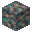</td>
			<td></td>
			<td></td>
			<td>100</td>
			<td>7</td>
		</tr>
	</tablebody>
</table>
<table>
	<tablebody>
		<tr>
			<td></td>
			<td>圖示</td>
			<td>名稱</td>
			<td>標簽</td>
			<td>數量</td>
		</tr>
		<tr>
			<td></td>
			<td></td>
			<td>深板岩銅礦</td>
			<td>deepslate_copper_ore</td>
			<td>1</td>
		</tr>
		<tr>
			<td></td>
			<td></td>
			<td>銅方塊</td>
			<td>copper_block</td>
			<td>1</td>
		</tr>
	</tablebody>
</table>

---
<!-- iron_block__from__blasting__use__deepslate_iron_ore.md -->

<!-- zh_tw -->

## 鐵方塊 | 高爐 | 深板岩鐵礦

<table>
	<tablebody>
		<tr>
			<td colspan="3">高爐</td>
			<td>時長</td>
			<td>經驗</td>
		</tr>
		<tr>
			<td>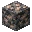</td>
			<td></td>
			<td></td>
			<td>100</td>
			<td>7</td>
		</tr>
	</tablebody>
</table>
<table>
	<tablebody>
		<tr>
			<td></td>
			<td>圖示</td>
			<td>名稱</td>
			<td>標簽</td>
			<td>數量</td>
		</tr>
		<tr>
			<td></td>
			<td></td>
			<td>深板岩鐵礦</td>
			<td>deepslate_iron_ore</td>
			<td>1</td>
		</tr>
		<tr>
			<td></td>
			<td></td>
			<td>鐵方塊</td>
			<td>iron_block</td>
			<td>1</td>
		</tr>
	</tablebody>
</table>

---
<!-- iron_block__from__blasting__use__iron_ore.md -->

<!-- zh_tw -->

## 鐵方塊 | 高爐 | 鐵礦

<table>
	<tablebody>
		<tr>
			<td colspan="3">高爐</td>
			<td>時長</td>
			<td>經驗</td>
		</tr>
		<tr>
			<td>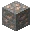</td>
			<td></td>
			<td></td>
			<td>100</td>
			<td>7</td>
		</tr>
	</tablebody>
</table>
<table>
	<tablebody>
		<tr>
			<td></td>
			<td>圖示</td>
			<td>名稱</td>
			<td>標簽</td>
			<td>數量</td>
		</tr>
		<tr>
			<td></td>
			<td></td>
			<td>鐵礦</td>
			<td>iron_ore</td>
			<td>1</td>
		</tr>
		<tr>
			<td></td>
			<td></td>
			<td>鐵方塊</td>
			<td>iron_block</td>
			<td>1</td>
		</tr>
	</tablebody>
</table>

---
<!-- gold_block__from__blasting__use__deepslate_gold_ore.md -->

<!-- zh_tw -->

## 黃金方塊 | 高爐 | 深板岩金礦

<table>
	<tablebody>
		<tr>
			<td colspan="3">高爐</td>
			<td>時長</td>
			<td>經驗</td>
		</tr>
		<tr>
			<td>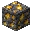</td>
			<td></td>
			<td></td>
			<td>100</td>
			<td>10</td>
		</tr>
	</tablebody>
</table>
<table>
	<tablebody>
		<tr>
			<td></td>
			<td>圖示</td>
			<td>名稱</td>
			<td>標簽</td>
			<td>數量</td>
		</tr>
		<tr>
			<td></td>
			<td></td>
			<td>深板岩金礦</td>
			<td>deepslate_gold_ore</td>
			<td>1</td>
		</tr>
		<tr>
			<td></td>
			<td></td>
			<td>黃金方塊</td>
			<td>gold_block</td>
			<td>1</td>
		</tr>
	</tablebody>
</table>

---
<!-- gold_block__from__blasting__use__gilded_blackstone.md -->

<!-- zh_tw -->

## 黃金方塊 | 高爐 | 鑲金黑石

<table>
	<tablebody>
		<tr>
			<td colspan="3">高爐</td>
			<td>時長</td>
			<td>經驗</td>
		</tr>
		<tr>
			<td>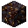</td>
			<td></td>
			<td></td>
			<td>100</td>
			<td>10</td>
		</tr>
	</tablebody>
</table>
<table>
	<tablebody>
		<tr>
			<td></td>
			<td>圖示</td>
			<td>名稱</td>
			<td>標簽</td>
			<td>數量</td>
		</tr>
		<tr>
			<td></td>
			<td></td>
			<td>鑲金黑石</td>
			<td>gilded_blackstone</td>
			<td>1</td>
		</tr>
		<tr>
			<td></td>
			<td></td>
			<td>黃金方塊</td>
			<td>gold_block</td>
			<td>1</td>
		</tr>
	</tablebody>
</table>

---
<!-- gold_block__from__blasting__use__gold_ore.md -->

<!-- zh_tw -->

## 黃金方塊 | 高爐 | 金礦

<table>
	<tablebody>
		<tr>
			<td colspan="3">高爐</td>
			<td>時長</td>
			<td>經驗</td>
		</tr>
		<tr>
			<td>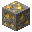</td>
			<td></td>
			<td></td>
			<td>100</td>
			<td>10</td>
		</tr>
	</tablebody>
</table>
<table>
	<tablebody>
		<tr>
			<td></td>
			<td>圖示</td>
			<td>名稱</td>
			<td>標簽</td>
			<td>數量</td>
		</tr>
		<tr>
			<td></td>
			<td></td>
			<td>金礦</td>
			<td>gold_ore</td>
			<td>1</td>
		</tr>
		<tr>
			<td></td>
			<td></td>
			<td>黃金方塊</td>
			<td>gold_block</td>
			<td>1</td>
		</tr>
	</tablebody>
</table>

---
<!-- gold_block__from__blasting__use__nether_gold_ore.md -->

<!-- zh_tw -->

## 黃金方塊 | 高爐 | 地獄金礦

<table>
	<tablebody>
		<tr>
			<td colspan="3">高爐</td>
			<td>時長</td>
			<td>經驗</td>
		</tr>
		<tr>
			<td>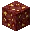</td>
			<td></td>
			<td></td>
			<td>100</td>
			<td>10</td>
		</tr>
	</tablebody>
</table>
<table>
	<tablebody>
		<tr>
			<td></td>
			<td>圖示</td>
			<td>名稱</td>
			<td>標簽</td>
			<td>數量</td>
		</tr>
		<tr>
			<td></td>
			<td></td>
			<td>地獄金礦</td>
			<td>nether_gold_ore</td>
			<td>1</td>
		</tr>
		<tr>
			<td></td>
			<td></td>
			<td>黃金方塊</td>
			<td>gold_block</td>
			<td>1</td>
		</tr>
	</tablebody>
</table>

---
<!-- coal_block__from__blasting__use__coal_ore.md -->

<!-- zh_tw -->

## 煤炭方塊 | 高爐 | 煤礦

<table>
	<tablebody>
		<tr>
			<td colspan="3">高爐</td>
			<td>時長</td>
			<td>經驗</td>
		</tr>
		<tr>
			<td>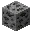</td>
			<td></td>
			<td></td>
			<td>100</td>
			<td>1</td>
		</tr>
	</tablebody>
</table>
<table>
	<tablebody>
		<tr>
			<td></td>
			<td>圖示</td>
			<td>名稱</td>
			<td>標簽</td>
			<td>數量</td>
		</tr>
		<tr>
			<td></td>
			<td></td>
			<td>煤礦</td>
			<td>coal_ore</td>
			<td>1</td>
		</tr>
		<tr>
			<td></td>
			<td></td>
			<td>煤炭方塊</td>
			<td>coal_block</td>
			<td>1</td>
		</tr>
	</tablebody>
</table>

---
<!-- coal_block__from__blasting__use__deepslate_coal_ore.md -->

<!-- zh_tw -->

## 煤炭方塊 | 高爐 | 深板岩煤礦

<table>
	<tablebody>
		<tr>
			<td colspan="3">高爐</td>
			<td>時長</td>
			<td>經驗</td>
		</tr>
		<tr>
			<td>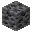</td>
			<td></td>
			<td></td>
			<td>100</td>
			<td>1</td>
		</tr>
	</tablebody>
</table>
<table>
	<tablebody>
		<tr>
			<td></td>
			<td>圖示</td>
			<td>名稱</td>
			<td>標簽</td>
			<td>數量</td>
		</tr>
		<tr>
			<td></td>
			<td></td>
			<td>深板岩煤礦</td>
			<td>deepslate_coal_ore</td>
			<td>1</td>
		</tr>
		<tr>
			<td></td>
			<td></td>
			<td>煤炭方塊</td>
			<td>coal_block</td>
			<td>1</td>
		</tr>
	</tablebody>
</table>

---
<!-- lapis_block__from__blasting__use__deepslate_lapis_ore.md -->

<!-- zh_tw -->

## 青金石方塊 | 高爐 | 深板岩青金石礦

<table>
	<tablebody>
		<tr>
			<td colspan="3">高爐</td>
			<td>時長</td>
			<td>經驗</td>
		</tr>
		<tr>
			<td>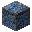</td>
			<td></td>
			<td></td>
			<td>100</td>
			<td>2</td>
		</tr>
	</tablebody>
</table>
<table>
	<tablebody>
		<tr>
			<td></td>
			<td>圖示</td>
			<td>名稱</td>
			<td>標簽</td>
			<td>數量</td>
		</tr>
		<tr>
			<td></td>
			<td></td>
			<td>深板岩青金石礦</td>
			<td>deepslate_lapis_ore</td>
			<td>1</td>
		</tr>
		<tr>
			<td></td>
			<td></td>
			<td>青金石方塊</td>
			<td>lapis_block</td>
			<td>1</td>
		</tr>
	</tablebody>
</table>

---
<!-- lapis_block__from__blasting__use__lapis_ore.md -->

<!-- zh_tw -->

## 青金石方塊 | 高爐 | 青金石礦

<table>
	<tablebody>
		<tr>
			<td colspan="3">高爐</td>
			<td>時長</td>
			<td>經驗</td>
		</tr>
		<tr>
			<td>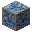</td>
			<td></td>
			<td></td>
			<td>100</td>
			<td>2</td>
		</tr>
	</tablebody>
</table>
<table>
	<tablebody>
		<tr>
			<td></td>
			<td>圖示</td>
			<td>名稱</td>
			<td>標簽</td>
			<td>數量</td>
		</tr>
		<tr>
			<td></td>
			<td></td>
			<td>青金石礦</td>
			<td>lapis_ore</td>
			<td>1</td>
		</tr>
		<tr>
			<td></td>
			<td></td>
			<td>青金石方塊</td>
			<td>lapis_block</td>
			<td>1</td>
		</tr>
	</tablebody>
</table>

---
<!-- quartz_block__from__blasting__use__nether_quartz_ore.md -->

<!-- zh_tw -->

## 石英方塊 | 高爐 | 地獄石英礦

<table>
	<tablebody>
		<tr>
			<td colspan="3">高爐</td>
			<td>時長</td>
			<td>經驗</td>
		</tr>
		<tr>
			<td>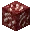</td>
			<td></td>
			<td>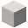</td>
			<td>100</td>
			<td>2</td>
		</tr>
	</tablebody>
</table>
<table>
	<tablebody>
		<tr>
			<td></td>
			<td>圖示</td>
			<td>名稱</td>
			<td>標簽</td>
			<td>數量</td>
		</tr>
		<tr>
			<td></td>
			<td></td>
			<td>地獄石英礦</td>
			<td>nether_quartz_ore</td>
			<td>1</td>
		</tr>
		<tr>
			<td></td>
			<td></td>
			<td>石英方塊</td>
			<td>quartz_block</td>
			<td>1</td>
		</tr>
	</tablebody>
</table>

---
<!-- redstone_block__from__blasting__use__deepslate_redstone_ore.md -->

<!-- zh_tw -->

## 紅石方塊 | 高爐 | 深板岩紅石礦

<table>
	<tablebody>
		<tr>
			<td colspan="3">高爐</td>
			<td>時長</td>
			<td>經驗</td>
		</tr>
		<tr>
			<td>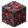</td>
			<td></td>
			<td>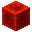</td>
			<td>100</td>
			<td>7</td>
		</tr>
	</tablebody>
</table>
<table>
	<tablebody>
		<tr>
			<td></td>
			<td>圖示</td>
			<td>名稱</td>
			<td>標簽</td>
			<td>數量</td>
		</tr>
		<tr>
			<td></td>
			<td></td>
			<td>深板岩紅石礦</td>
			<td>deepslate_redstone_ore</td>
			<td>1</td>
		</tr>
		<tr>
			<td></td>
			<td></td>
			<td>紅石方塊</td>
			<td>redstone_block</td>
			<td>1</td>
		</tr>
	</tablebody>
</table>

---
<!-- redstone_block__from__blasting__use__redstone_ore.md -->

<!-- zh_tw -->

## 紅石方塊 | 高爐 | 紅石礦

<table>
	<tablebody>
		<tr>
			<td colspan="3">高爐</td>
			<td>時長</td>
			<td>經驗</td>
		</tr>
		<tr>
			<td>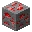</td>
			<td></td>
			<td></td>
			<td>100</td>
			<td>7</td>
		</tr>
	</tablebody>
</table>
<table>
	<tablebody>
		<tr>
			<td></td>
			<td>圖示</td>
			<td>名稱</td>
			<td>標簽</td>
			<td>數量</td>
		</tr>
		<tr>
			<td></td>
			<td></td>
			<td>紅石礦</td>
			<td>redstone_ore</td>
			<td>1</td>
		</tr>
		<tr>
			<td></td>
			<td></td>
			<td>紅石方塊</td>
			<td>redstone_block</td>
			<td>1</td>
		</tr>
	</tablebody>
</table>

---
<!-- emerald_block__from__blasting__use__deepslate_emerald_ore.md -->

<!-- zh_tw -->

## 綠寶石方塊 | 高爐 | 深板岩綠寶石礦

<table>
	<tablebody>
		<tr>
			<td colspan="3">高爐</td>
			<td>時長</td>
			<td>經驗</td>
		</tr>
		<tr>
			<td>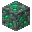</td>
			<td></td>
			<td>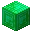</td>
			<td>100</td>
			<td>10</td>
		</tr>
	</tablebody>
</table>
<table>
	<tablebody>
		<tr>
			<td></td>
			<td>圖示</td>
			<td>名稱</td>
			<td>標簽</td>
			<td>數量</td>
		</tr>
		<tr>
			<td></td>
			<td></td>
			<td>深板岩綠寶石礦</td>
			<td>deepslate_emerald_ore</td>
			<td>1</td>
		</tr>
		<tr>
			<td></td>
			<td></td>
			<td>綠寶石方塊</td>
			<td>emerald_block</td>
			<td>1</td>
		</tr>
	</tablebody>
</table>

---
<!-- emerald_block__from__blasting__use__emerald_ore.md -->

<!-- zh_tw -->

## 綠寶石方塊 | 高爐 | 綠寶石礦

<table>
	<tablebody>
		<tr>
			<td colspan="3">高爐</td>
			<td>時長</td>
			<td>經驗</td>
		</tr>
		<tr>
			<td>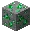</td>
			<td></td>
			<td></td>
			<td>100</td>
			<td>10</td>
		</tr>
	</tablebody>
</table>
<table>
	<tablebody>
		<tr>
			<td></td>
			<td>圖示</td>
			<td>名稱</td>
			<td>標簽</td>
			<td>數量</td>
		</tr>
		<tr>
			<td></td>
			<td></td>
			<td>綠寶石礦</td>
			<td>emerald_ore</td>
			<td>1</td>
		</tr>
		<tr>
			<td></td>
			<td></td>
			<td>綠寶石方塊</td>
			<td>emerald_block</td>
			<td>1</td>
		</tr>
	</tablebody>
</table>

---
<!-- diamond_block__from__blasting__use__deepslate_diamond_ore.md -->

<!-- zh_tw -->

## 鑽石方塊 | 高爐 | 深板岩鑽石礦

<table>
	<tablebody>
		<tr>
			<td colspan="3">高爐</td>
			<td>時長</td>
			<td>經驗</td>
		</tr>
		<tr>
			<td>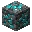</td>
			<td></td>
			<td>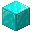</td>
			<td>100</td>
			<td>10</td>
		</tr>
	</tablebody>
</table>
<table>
	<tablebody>
		<tr>
			<td></td>
			<td>圖示</td>
			<td>名稱</td>
			<td>標簽</td>
			<td>數量</td>
		</tr>
		<tr>
			<td></td>
			<td></td>
			<td>深板岩鑽石礦</td>
			<td>deepslate_diamond_ore</td>
			<td>1</td>
		</tr>
		<tr>
			<td></td>
			<td></td>
			<td>鑽石方塊</td>
			<td>diamond_block</td>
			<td>1</td>
		</tr>
	</tablebody>
</table>

---
<!-- diamond_block__from__blasting__use__diamond_ore.md -->

<!-- zh_tw -->

## 鑽石方塊 | 高爐 | 鑽石礦

<table>
	<tablebody>
		<tr>
			<td colspan="3">高爐</td>
			<td>時長</td>
			<td>經驗</td>
		</tr>
		<tr>
			<td>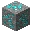</td>
			<td></td>
			<td></td>
			<td>100</td>
			<td>10</td>
		</tr>
	</tablebody>
</table>
<table>
	<tablebody>
		<tr>
			<td></td>
			<td>圖示</td>
			<td>名稱</td>
			<td>標簽</td>
			<td>數量</td>
		</tr>
		<tr>
			<td></td>
			<td></td>
			<td>鑽石礦</td>
			<td>diamond_ore</td>
			<td>1</td>
		</tr>
		<tr>
			<td></td>
			<td></td>
			<td>鑽石方塊</td>
			<td>diamond_block</td>
			<td>1</td>
		</tr>
	</tablebody>
</table>

---
<!-- netherite_block__from__blasting__use__ancient_debris.md -->

<!-- zh_tw -->

## 獄髓方塊 | 高爐 | 遠古遺骸

<table>
	<tablebody>
		<tr>
			<td colspan="3">高爐</td>
			<td>時長</td>
			<td>經驗</td>
		</tr>
		<tr>
			<td></td>
			<td></td>
			<td>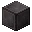</td>
			<td>100</td>
			<td>20</td>
		</tr>
	</tablebody>
</table>
<table>
	<tablebody>
		<tr>
			<td></td>
			<td>圖示</td>
			<td>名稱</td>
			<td>標簽</td>
			<td>數量</td>
		</tr>
		<tr>
			<td></td>
			<td></td>
			<td>遠古遺骸</td>
			<td>ancient_debris</td>
			<td>1</td>
		</tr>
		<tr>
			<td></td>
			<td></td>
			<td>獄髓方塊</td>
			<td>netherite_block</td>
			<td>1</td>
		</tr>
	</tablebody>
</table>

