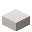
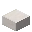
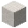
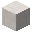
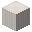
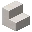

---
<!-- quartz__from__crafting_shapeless__use__quartz_block.md -->

<!-- zh_tw -->

## 地獄石英 | 工作台：無序 | 石英方塊

<table>
	<tablebody>
		<tr>
			<td colspan="5">工作台：無序</td>
		</tr>
		<tr>
			<td></td>
			<td></td>
			<td></td>
			<td colspan="2"></td>
		</tr>
		<tr>
			<td></td>
			<td></td>
			<td></td>
			<td></td>
			<td></td>
		</tr>
		<tr>
			<td></td>
			<td></td>
			<td></td>
			<td colspan="2"></td>
		</tr>
	</tablebody>
</table>
<table>
	<tablebody>
		<tr>
			<td></td>
			<td>圖示</td>
			<td>名稱</td>
			<td>標簽</td>
			<td>數量</td>
		</tr>
		<tr>
			<td></td>
			<td></td>
			<td>地獄石英</td>
			<td>quartz</td>
			<td>4</td>
		</tr>
		<tr>
			<td></td>
			<td></td>
			<td>石英方塊</td>
			<td>quartz_block</td>
			<td>1</td>
		</tr>
	</tablebody>
</table>

---
<!-- quartz__from__crafting_shapeless__use__quartz_slab.md -->

<!-- zh_tw -->

## 地獄石英 | 工作台：無序 | 石英半磚

<table>
	<tablebody>
		<tr>
			<td colspan="5">工作台：無序</td>
		</tr>
		<tr>
			<td></td>
			<td></td>
			<td></td>
			<td colspan="2"></td>
		</tr>
		<tr>
			<td></td>
			<td></td>
			<td></td>
			<td></td>
			<td></td>
		</tr>
		<tr>
			<td></td>
			<td></td>
			<td></td>
			<td colspan="2"></td>
		</tr>
	</tablebody>
</table>
<table>
	<tablebody>
		<tr>
			<td></td>
			<td>圖示</td>
			<td>名稱</td>
			<td>標簽</td>
			<td>數量</td>
		</tr>
		<tr>
			<td></td>
			<td></td>
			<td>地獄石英</td>
			<td>quartz</td>
			<td>2</td>
		</tr>
		<tr>
			<td rowspan="2"></td>
			<td></td>
			<td>石英半磚</td>
			<td>quartz_slab</td>
			<td rowspan="2">1</td>
		</tr>
		<tr>
			<td></td>
			<td>平滑石英半磚</td>
			<td>smooth_quartz_slab</td>
		</tr>
	</tablebody>
</table>

---
<!-- quartz_block__from__crafting_shapeless__use__chiseled_quartz_block.md -->

<!-- zh_tw -->

## 石英方塊 | 工作台：無序 | 浮雕石英方塊

<table>
	<tablebody>
		<tr>
			<td colspan="5">工作台：無序</td>
		</tr>
		<tr>
			<td></td>
			<td></td>
			<td></td>
			<td colspan="2"></td>
		</tr>
		<tr>
			<td></td>
			<td></td>
			<td></td>
			<td></td>
			<td></td>
		</tr>
		<tr>
			<td></td>
			<td></td>
			<td></td>
			<td colspan="2"></td>
		</tr>
	</tablebody>
</table>
<table>
	<tablebody>
		<tr>
			<td></td>
			<td>圖示</td>
			<td>名稱</td>
			<td>標簽</td>
			<td>數量</td>
		</tr>
		<tr>
			<td></td>
			<td></td>
			<td>石英方塊</td>
			<td>quartz_block</td>
			<td>1</td>
		</tr>
		<tr>
			<td rowspan="6"></td>
			<td></td>
			<td>浮雕石英方塊</td>
			<td>chiseled_quartz_block</td>
			<td rowspan="6">1</td>
		</tr>
		<tr>
			<td></td>
			<td>平滑石英方塊</td>
			<td>smooth_quartz</td>
		</tr>
		<tr>
			<td></td>
			<td>石英磚</td>
			<td>quartz_bricks</td>
		</tr>
		<tr>
			<td></td>
			<td>石英柱</td>
			<td>quartz_pillar</td>
		</tr>
		<tr>
			<td></td>
			<td>石英階梯</td>
			<td>quartz_stairs</td>
		</tr>
		<tr>
			<td></td>
			<td>平滑石英階梯</td>
			<td>smooth_quartz_stairs</td>
		</tr>
	</tablebody>
</table>

