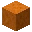
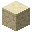
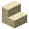
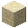
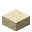

---
<!-- red_sand__from__stonecutting__use__red_sandstone.md -->

<!-- zh_tw -->

## 紅沙 | 切石機 | 紅砂岩

<table>
	<tablebody>
		<tr>
			<td colspan="6">切石機</td>
		</tr>
		<tr>
			<td colspan="2"></td>
			<td></td>
			<td></td>
			<td></td>
			<td></td>
		</tr>
		<tr>
			<td></td>
			<td></td>
			<td></td>
			<td></td>
			<td></td>
			<td></td>
		</tr>
		<tr>
			<td colspan="2"></td>
			<td></td>
			<td></td>
			<td></td>
			<td></td>
		</tr>
	</tablebody>
</table>
<table>
	<tablebody>
		<tr>
			<td></td>
			<td>圖示</td>
			<td>名稱</td>
			<td>標簽</td>
			<td>數量</td>
		</tr>
		<tr>
			<td></td>
			<td></td>
			<td>紅砂岩</td>
			<td>red_sandstone</td>
			<td>1</td>
		</tr>
		<tr>
			<td></td>
			<td></td>
			<td>切製紅砂岩</td>
			<td>cut_red_sandstone</td>
			<td>1</td>
		</tr>
		<tr>
			<td></td>
			<td></td>
			<td>紅砂岩階梯</td>
			<td>red_sandstone_stairs</td>
			<td>1</td>
		</tr>
		<tr>
			<td></td>
			<td></td>
			<td>紅砂岩牆</td>
			<td>red_sandstone_wall</td>
			<td>1</td>
		</tr>
		<tr>
			<td></td>
			<td></td>
			<td>浮雕紅砂岩</td>
			<td>chiseled_red_sandstone</td>
			<td>1</td>
		</tr>
		<tr>
			<td></td>
			<td></td>
			<td>平滑紅砂岩</td>
			<td>smooth_red_sandstone</td>
			<td>1</td>
		</tr>
		<tr>
			<td></td>
			<td></td>
			<td>平滑紅砂岩階梯</td>
			<td>smooth_red_sandstone_stairs</td>
			<td>1</td>
		</tr>
		<tr>
			<td></td>
			<td></td>
			<td>紅沙</td>
			<td>red_sand</td>
			<td>4</td>
		</tr>
	</tablebody>
</table>

---
<!-- red_sand__from__stonecutting__use__red_sandstone_slab.md -->

<!-- zh_tw -->

## 紅沙 | 切石機 | 紅砂岩半磚

<table>
	<tablebody>
		<tr>
			<td colspan="6">切石機</td>
		</tr>
		<tr>
			<td colspan="2"></td>
			<td></td>
			<td></td>
			<td></td>
			<td></td>
		</tr>
		<tr>
			<td></td>
			<td></td>
			<td></td>
			<td></td>
			<td></td>
			<td></td>
		</tr>
		<tr>
			<td colspan="2"></td>
			<td></td>
			<td></td>
			<td></td>
			<td></td>
		</tr>
	</tablebody>
</table>
<table>
	<tablebody>
		<tr>
			<td></td>
			<td>圖示</td>
			<td>名稱</td>
			<td>標簽</td>
			<td>數量</td>
		</tr>
		<tr>
			<td></td>
			<td></td>
			<td>紅砂岩半磚</td>
			<td>red_sandstone_slab</td>
			<td>1</td>
		</tr>
		<tr>
			<td></td>
			<td></td>
			<td>切製紅砂岩半磚</td>
			<td>cut_red_sandstone_slab</td>
			<td>1</td>
		</tr>
		<tr>
			<td></td>
			<td></td>
			<td>平滑紅砂岩半磚</td>
			<td>smooth_red_sandstone_slab</td>
			<td>1</td>
		</tr>
		<tr>
			<td></td>
			<td></td>
			<td>紅沙</td>
			<td>red_sand</td>
			<td>2</td>
		</tr>
	</tablebody>
</table>

---
<!-- sand__from__stonecutting__use__sandstone.md -->

<!-- zh_tw -->

## 沙 | 切石機 | 砂岩

<table>
	<tablebody>
		<tr>
			<td colspan="6">切石機</td>
		</tr>
		<tr>
			<td colspan="2"></td>
			<td></td>
			<td></td>
			<td></td>
			<td></td>
		</tr>
		<tr>
			<td></td>
			<td></td>
			<td></td>
			<td></td>
			<td></td>
			<td></td>
		</tr>
		<tr>
			<td colspan="2"></td>
			<td></td>
			<td></td>
			<td></td>
			<td></td>
		</tr>
	</tablebody>
</table>
<table>
	<tablebody>
		<tr>
			<td></td>
			<td>圖示</td>
			<td>名稱</td>
			<td>標簽</td>
			<td>數量</td>
		</tr>
		<tr>
			<td></td>
			<td></td>
			<td>砂岩</td>
			<td>sandstone</td>
			<td>1</td>
		</tr>
		<tr>
			<td></td>
			<td></td>
			<td>切製砂岩</td>
			<td>cut_sandstone</td>
			<td>1</td>
		</tr>
		<tr>
			<td></td>
			<td></td>
			<td>砂岩階梯</td>
			<td>sandstone_stairs</td>
			<td>1</td>
		</tr>
		<tr>
			<td></td>
			<td></td>
			<td>砂岩牆</td>
			<td>sandstone_wall</td>
			<td>1</td>
		</tr>
		<tr>
			<td></td>
			<td></td>
			<td>浮雕砂岩</td>
			<td>chiseled_sandstone</td>
			<td>1</td>
		</tr>
		<tr>
			<td></td>
			<td></td>
			<td>平滑砂岩</td>
			<td>smooth_sandstone</td>
			<td>1</td>
		</tr>
		<tr>
			<td></td>
			<td></td>
			<td>平滑砂岩階梯</td>
			<td>smooth_sandstone_stairs</td>
			<td>1</td>
		</tr>
		<tr>
			<td></td>
			<td></td>
			<td>沙</td>
			<td>sand</td>
			<td>4</td>
		</tr>
	</tablebody>
</table>

---
<!-- sand__from__stonecutting__use__sandstone_slab.md -->

<!-- zh_tw -->

## 沙 | 切石機 | 砂岩半磚

<table>
	<tablebody>
		<tr>
			<td colspan="6">切石機</td>
		</tr>
		<tr>
			<td colspan="2"></td>
			<td></td>
			<td></td>
			<td></td>
			<td></td>
		</tr>
		<tr>
			<td></td>
			<td></td>
			<td></td>
			<td></td>
			<td></td>
			<td></td>
		</tr>
		<tr>
			<td colspan="2"></td>
			<td></td>
			<td></td>
			<td></td>
			<td></td>
		</tr>
	</tablebody>
</table>
<table>
	<tablebody>
		<tr>
			<td></td>
			<td>圖示</td>
			<td>名稱</td>
			<td>標簽</td>
			<td>數量</td>
		</tr>
		<tr>
			<td></td>
			<td></td>
			<td>砂岩半磚</td>
			<td>sandstone_slab</td>
			<td>1</td>
		</tr>
		<tr>
			<td></td>
			<td></td>
			<td>切製砂岩半磚</td>
			<td>cut_sandstone_slab</td>
			<td>1</td>
		</tr>
		<tr>
			<td></td>
			<td></td>
			<td>平滑砂岩半磚</td>
			<td>smooth_sandstone_slab</td>
			<td>1</td>
		</tr>
		<tr>
			<td></td>
			<td></td>
			<td>沙</td>
			<td>sand</td>
			<td>2</td>
		</tr>
	</tablebody>
</table>

