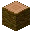

---
<!-- acacia_log__from__crafting_shapeless__use__acacia_sapling.md -->

<!-- zh_tw -->

## 相思木原木 | 工作台：無序 | 相思木樹苗

<table>
	<tablebody>
		<tr>
			<td colspan="5">工作台：無序</td>
		</tr>
		<tr>
			<td></td>
			<td></td>
			<td></td>
			<td colspan="2"></td>
		</tr>
		<tr>
			<td></td>
			<td></td>
			<td></td>
			<td></td>
			<td></td>
		</tr>
		<tr>
			<td></td>
			<td></td>
			<td></td>
			<td colspan="2"></td>
		</tr>
	</tablebody>
</table>
<table>
	<tablebody>
		<tr>
			<td></td>
			<td>圖示</td>
			<td>名稱</td>
			<td>標簽</td>
			<td>數量</td>
		</tr>
		<tr>
			<td></td>
			<td></td>
			<td>相思木原木</td>
			<td>acacia_log</td>
			<td>64</td>
		</tr>
		<tr>
			<td></td>
			<td></td>
			<td>相思木樹苗</td>
			<td>acacia_sapling</td>
			<td>1</td>
		</tr>
		<tr>
			<td></td>
			<td></td>
			<td>骨粉</td>
			<td>bone_meal</td>
			<td>1</td>
		</tr>
	</tablebody>
</table>

---
<!-- birch_log__from__crafting_shapeless__use__birch_sapling.md -->

<!-- zh_tw -->

## 樺木原木 | 工作台：無序 | 樺木樹苗

<table>
	<tablebody>
		<tr>
			<td colspan="5">工作台：無序</td>
		</tr>
		<tr>
			<td></td>
			<td></td>
			<td></td>
			<td colspan="2"></td>
		</tr>
		<tr>
			<td></td>
			<td></td>
			<td></td>
			<td></td>
			<td></td>
		</tr>
		<tr>
			<td></td>
			<td></td>
			<td></td>
			<td colspan="2"></td>
		</tr>
	</tablebody>
</table>
<table>
	<tablebody>
		<tr>
			<td></td>
			<td>圖示</td>
			<td>名稱</td>
			<td>標簽</td>
			<td>數量</td>
		</tr>
		<tr>
			<td></td>
			<td></td>
			<td>樺木原木</td>
			<td>birch_log</td>
			<td>64</td>
		</tr>
		<tr>
			<td></td>
			<td></td>
			<td>樺木樹苗</td>
			<td>birch_sapling</td>
			<td>1</td>
		</tr>
		<tr>
			<td></td>
			<td></td>
			<td>骨粉</td>
			<td>bone_meal</td>
			<td>1</td>
		</tr>
	</tablebody>
</table>

---
<!-- dark_oak_log__from__crafting_shapeless__use__dark_oak_sapling.md -->

<!-- zh_tw -->

## 黑橡木原木 | 工作台：無序 | 黑橡木樹苗

<table>
	<tablebody>
		<tr>
			<td colspan="5">工作台：無序</td>
		</tr>
		<tr>
			<td></td>
			<td></td>
			<td></td>
			<td colspan="2"></td>
		</tr>
		<tr>
			<td></td>
			<td></td>
			<td></td>
			<td></td>
			<td></td>
		</tr>
		<tr>
			<td></td>
			<td></td>
			<td></td>
			<td colspan="2"></td>
		</tr>
	</tablebody>
</table>
<table>
	<tablebody>
		<tr>
			<td></td>
			<td>圖示</td>
			<td>名稱</td>
			<td>標簽</td>
			<td>數量</td>
		</tr>
		<tr>
			<td></td>
			<td></td>
			<td>黑橡木原木</td>
			<td>dark_oak_log</td>
			<td>64</td>
		</tr>
		<tr>
			<td></td>
			<td></td>
			<td>黑橡木樹苗</td>
			<td>dark_oak_sapling</td>
			<td>1</td>
		</tr>
		<tr>
			<td></td>
			<td></td>
			<td>骨粉</td>
			<td>bone_meal</td>
			<td>1</td>
		</tr>
	</tablebody>
</table>

---
<!-- jungle_log__from__crafting_shapeless__use__jungle_sapling.md -->

<!-- zh_tw -->

## 叢林木原木 | 工作台：無序 | 叢林木樹苗

<table>
	<tablebody>
		<tr>
			<td colspan="5">工作台：無序</td>
		</tr>
		<tr>
			<td></td>
			<td></td>
			<td></td>
			<td colspan="2"></td>
		</tr>
		<tr>
			<td></td>
			<td></td>
			<td></td>
			<td></td>
			<td></td>
		</tr>
		<tr>
			<td></td>
			<td></td>
			<td></td>
			<td colspan="2"></td>
		</tr>
	</tablebody>
</table>
<table>
	<tablebody>
		<tr>
			<td></td>
			<td>圖示</td>
			<td>名稱</td>
			<td>標簽</td>
			<td>數量</td>
		</tr>
		<tr>
			<td></td>
			<td></td>
			<td>叢林木原木</td>
			<td>jungle_log</td>
			<td>64</td>
		</tr>
		<tr>
			<td></td>
			<td></td>
			<td>叢林木樹苗</td>
			<td>jungle_sapling</td>
			<td>1</td>
		</tr>
		<tr>
			<td></td>
			<td></td>
			<td>骨粉</td>
			<td>bone_meal</td>
			<td>1</td>
		</tr>
	</tablebody>
</table>

---
<!-- oak_log__from__crafting_shapeless__use__oak_sapling.md -->

<!-- zh_tw -->

## 橡木原木 | 工作台：無序 | 橡木樹苗

<table>
	<tablebody>
		<tr>
			<td colspan="5">工作台：無序</td>
		</tr>
		<tr>
			<td></td>
			<td></td>
			<td></td>
			<td colspan="2"></td>
		</tr>
		<tr>
			<td></td>
			<td></td>
			<td></td>
			<td></td>
			<td></td>
		</tr>
		<tr>
			<td></td>
			<td></td>
			<td></td>
			<td colspan="2"></td>
		</tr>
	</tablebody>
</table>
<table>
	<tablebody>
		<tr>
			<td></td>
			<td>圖示</td>
			<td>名稱</td>
			<td>標簽</td>
			<td>數量</td>
		</tr>
		<tr>
			<td></td>
			<td></td>
			<td>橡木原木</td>
			<td>oak_log</td>
			<td>64</td>
		</tr>
		<tr>
			<td></td>
			<td></td>
			<td>橡木樹苗</td>
			<td>oak_sapling</td>
			<td>1</td>
		</tr>
		<tr>
			<td></td>
			<td></td>
			<td>骨粉</td>
			<td>bone_meal</td>
			<td>1</td>
		</tr>
	</tablebody>
</table>

---
<!-- spruce_log__from__crafting_shapeless__use__spruce_sapling.md -->

<!-- zh_tw -->

## 杉木原木 | 工作台：無序 | 杉木樹苗

<table>
	<tablebody>
		<tr>
			<td colspan="5">工作台：無序</td>
		</tr>
		<tr>
			<td></td>
			<td></td>
			<td></td>
			<td colspan="2"></td>
		</tr>
		<tr>
			<td></td>
			<td></td>
			<td></td>
			<td></td>
			<td></td>
		</tr>
		<tr>
			<td></td>
			<td></td>
			<td></td>
			<td colspan="2"></td>
		</tr>
	</tablebody>
</table>
<table>
	<tablebody>
		<tr>
			<td></td>
			<td>圖示</td>
			<td>名稱</td>
			<td>標簽</td>
			<td>數量</td>
		</tr>
		<tr>
			<td></td>
			<td></td>
			<td>杉木原木</td>
			<td>spruce_log</td>
			<td>64</td>
		</tr>
		<tr>
			<td></td>
			<td></td>
			<td>杉木樹苗</td>
			<td>spruce_sapling</td>
			<td>1</td>
		</tr>
		<tr>
			<td></td>
			<td></td>
			<td>骨粉</td>
			<td>bone_meal</td>
			<td>1</td>
		</tr>
	</tablebody>
</table>

