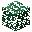

---
<!-- acacia_sapling__from__crafting_shapeless__use__acacia_leaves.md -->

<!-- zh_tw -->

## 相思木樹苗 | 工作台：無序 | 相思木樹葉

<table>
	<tablebody>
		<tr>
			<td colspan="5">工作台：無序</td>
		</tr>
		<tr>
			<td></td>
			<td></td>
			<td></td>
			<td colspan="2"></td>
		</tr>
		<tr>
			<td></td>
			<td></td>
			<td></td>
			<td></td>
			<td></td>
		</tr>
		<tr>
			<td></td>
			<td></td>
			<td></td>
			<td colspan="2"></td>
		</tr>
	</tablebody>
</table>
<table>
	<tablebody>
		<tr>
			<td></td>
			<td>圖示</td>
			<td>名稱</td>
			<td>標簽</td>
			<td>數量</td>
		</tr>
		<tr>
			<td></td>
			<td></td>
			<td>相思木樹苗</td>
			<td>acacia_sapling</td>
			<td>1</td>
		</tr>
		<tr>
			<td></td>
			<td></td>
			<td>相思木樹葉</td>
			<td>acacia_leaves</td>
			<td>1</td>
		</tr>
		<tr>
			<td></td>
			<td></td>
			<td>木棒</td>
			<td>stick</td>
			<td>1</td>
		</tr>
	</tablebody>
</table>

---
<!-- birch_sapling__from__crafting_shapeless__use__birch_leaves.md -->

<!-- zh_tw -->

## 樺木樹苗 | 工作台：無序 | 樺木樹葉

<table>
	<tablebody>
		<tr>
			<td colspan="5">工作台：無序</td>
		</tr>
		<tr>
			<td></td>
			<td></td>
			<td></td>
			<td colspan="2"></td>
		</tr>
		<tr>
			<td></td>
			<td></td>
			<td></td>
			<td></td>
			<td></td>
		</tr>
		<tr>
			<td></td>
			<td></td>
			<td></td>
			<td colspan="2"></td>
		</tr>
	</tablebody>
</table>
<table>
	<tablebody>
		<tr>
			<td></td>
			<td>圖示</td>
			<td>名稱</td>
			<td>標簽</td>
			<td>數量</td>
		</tr>
		<tr>
			<td></td>
			<td></td>
			<td>樺木樹苗</td>
			<td>birch_sapling</td>
			<td>1</td>
		</tr>
		<tr>
			<td></td>
			<td></td>
			<td>樺木樹葉</td>
			<td>birch_leaves</td>
			<td>1</td>
		</tr>
		<tr>
			<td></td>
			<td></td>
			<td>木棒</td>
			<td>stick</td>
			<td>1</td>
		</tr>
	</tablebody>
</table>

---
<!-- dark_oak_sapling__from__crafting_shapeless__use__dark_oak_leaves.md -->

<!-- zh_tw -->

## 黑橡木樹苗 | 工作台：無序 | 黑橡木樹葉

<table>
	<tablebody>
		<tr>
			<td colspan="5">工作台：無序</td>
		</tr>
		<tr>
			<td></td>
			<td></td>
			<td></td>
			<td colspan="2"></td>
		</tr>
		<tr>
			<td></td>
			<td></td>
			<td></td>
			<td></td>
			<td></td>
		</tr>
		<tr>
			<td></td>
			<td></td>
			<td></td>
			<td colspan="2"></td>
		</tr>
	</tablebody>
</table>
<table>
	<tablebody>
		<tr>
			<td></td>
			<td>圖示</td>
			<td>名稱</td>
			<td>標簽</td>
			<td>數量</td>
		</tr>
		<tr>
			<td></td>
			<td></td>
			<td>黑橡木樹苗</td>
			<td>dark_oak_sapling</td>
			<td>1</td>
		</tr>
		<tr>
			<td></td>
			<td></td>
			<td>黑橡木樹葉</td>
			<td>dark_oak_leaves</td>
			<td>1</td>
		</tr>
		<tr>
			<td></td>
			<td></td>
			<td>木棒</td>
			<td>stick</td>
			<td>1</td>
		</tr>
	</tablebody>
</table>

---
<!-- jungle_sapling__from__crafting_shapeless__use__jungle_leaves.md -->

<!-- zh_tw -->

## 叢林木樹苗 | 工作台：無序 | 叢林木樹葉

<table>
	<tablebody>
		<tr>
			<td colspan="5">工作台：無序</td>
		</tr>
		<tr>
			<td></td>
			<td></td>
			<td></td>
			<td colspan="2"></td>
		</tr>
		<tr>
			<td></td>
			<td></td>
			<td></td>
			<td></td>
			<td></td>
		</tr>
		<tr>
			<td></td>
			<td></td>
			<td></td>
			<td colspan="2"></td>
		</tr>
	</tablebody>
</table>
<table>
	<tablebody>
		<tr>
			<td></td>
			<td>圖示</td>
			<td>名稱</td>
			<td>標簽</td>
			<td>數量</td>
		</tr>
		<tr>
			<td></td>
			<td></td>
			<td>叢林木樹苗</td>
			<td>jungle_sapling</td>
			<td>1</td>
		</tr>
		<tr>
			<td></td>
			<td></td>
			<td>叢林木樹葉</td>
			<td>jungle_leaves</td>
			<td>1</td>
		</tr>
		<tr>
			<td></td>
			<td></td>
			<td>木棒</td>
			<td>stick</td>
			<td>1</td>
		</tr>
	</tablebody>
</table>

---
<!-- oak_sapling__from__crafting_shapeless__use__oak_leaves.md -->

<!-- zh_tw -->

## 橡木樹苗 | 工作台：無序 | 橡木樹葉

<table>
	<tablebody>
		<tr>
			<td colspan="5">工作台：無序</td>
		</tr>
		<tr>
			<td></td>
			<td></td>
			<td></td>
			<td colspan="2"></td>
		</tr>
		<tr>
			<td></td>
			<td></td>
			<td></td>
			<td></td>
			<td></td>
		</tr>
		<tr>
			<td></td>
			<td></td>
			<td></td>
			<td colspan="2"></td>
		</tr>
	</tablebody>
</table>
<table>
	<tablebody>
		<tr>
			<td></td>
			<td>圖示</td>
			<td>名稱</td>
			<td>標簽</td>
			<td>數量</td>
		</tr>
		<tr>
			<td></td>
			<td></td>
			<td>橡木樹苗</td>
			<td>oak_sapling</td>
			<td>1</td>
		</tr>
		<tr>
			<td></td>
			<td></td>
			<td>橡木樹葉</td>
			<td>oak_leaves</td>
			<td>1</td>
		</tr>
		<tr>
			<td></td>
			<td></td>
			<td>木棒</td>
			<td>stick</td>
			<td>1</td>
		</tr>
	</tablebody>
</table>

---
<!-- spruce_sapling__from__crafting_shapeless__use__spruce_leaves.md -->

<!-- zh_tw -->

## 杉木樹苗 | 工作台：無序 | 杉木樹葉

<table>
	<tablebody>
		<tr>
			<td colspan="5">工作台：無序</td>
		</tr>
		<tr>
			<td></td>
			<td></td>
			<td></td>
			<td colspan="2"></td>
		</tr>
		<tr>
			<td></td>
			<td></td>
			<td></td>
			<td></td>
			<td></td>
		</tr>
		<tr>
			<td></td>
			<td></td>
			<td></td>
			<td colspan="2"></td>
		</tr>
	</tablebody>
</table>
<table>
	<tablebody>
		<tr>
			<td></td>
			<td>圖示</td>
			<td>名稱</td>
			<td>標簽</td>
			<td>數量</td>
		</tr>
		<tr>
			<td></td>
			<td></td>
			<td>杉木樹苗</td>
			<td>spruce_sapling</td>
			<td>1</td>
		</tr>
		<tr>
			<td></td>
			<td></td>
			<td>杉木樹葉</td>
			<td>spruce_leaves</td>
			<td>1</td>
		</tr>
		<tr>
			<td></td>
			<td></td>
			<td>木棒</td>
			<td>stick</td>
			<td>1</td>
		</tr>
	</tablebody>
</table>

---
<!-- crimson_stem__from__crafting_shapeless__use__crimson_fungus.md -->

<!-- zh_tw -->

## 緋紅蕈柄 | 工作台：無序 | 緋紅蕈菇

<table>
	<tablebody>
		<tr>
			<td colspan="5">工作台：無序</td>
		</tr>
		<tr>
			<td></td>
			<td></td>
			<td></td>
			<td colspan="2"></td>
		</tr>
		<tr>
			<td></td>
			<td></td>
			<td></td>
			<td></td>
			<td></td>
		</tr>
		<tr>
			<td></td>
			<td></td>
			<td></td>
			<td colspan="2"></td>
		</tr>
	</tablebody>
</table>
<table>
	<tablebody>
		<tr>
			<td></td>
			<td>圖示</td>
			<td>名稱</td>
			<td>標簽</td>
			<td>數量</td>
		</tr>
		<tr>
			<td></td>
			<td></td>
			<td>緋紅蕈柄</td>
			<td>crimson_stem</td>
			<td>64</td>
		</tr>
		<tr>
			<td></td>
			<td></td>
			<td>緋紅蕈菇</td>
			<td>crimson_fungus</td>
			<td>1</td>
		</tr>
		<tr>
			<td></td>
			<td></td>
			<td>骨粉</td>
			<td>bone_meal</td>
			<td>1</td>
		</tr>
	</tablebody>
</table>

---
<!-- warped_stem__from__crafting_shapeless__use__warped_fungus.md -->

<!-- zh_tw -->

## 扭曲蕈柄 | 工作台：無序 | 扭曲蕈菇

<table>
	<tablebody>
		<tr>
			<td colspan="5">工作台：無序</td>
		</tr>
		<tr>
			<td></td>
			<td></td>
			<td></td>
			<td colspan="2"></td>
		</tr>
		<tr>
			<td></td>
			<td></td>
			<td></td>
			<td></td>
			<td></td>
		</tr>
		<tr>
			<td></td>
			<td></td>
			<td></td>
			<td colspan="2"></td>
		</tr>
	</tablebody>
</table>
<table>
	<tablebody>
		<tr>
			<td></td>
			<td>圖示</td>
			<td>名稱</td>
			<td>標簽</td>
			<td>數量</td>
		</tr>
		<tr>
			<td></td>
			<td></td>
			<td>扭曲蕈柄</td>
			<td>warped_stem</td>
			<td>64</td>
		</tr>
		<tr>
			<td></td>
			<td></td>
			<td>扭曲蕈菇</td>
			<td>warped_fungus</td>
			<td>1</td>
		</tr>
		<tr>
			<td></td>
			<td></td>
			<td>骨粉</td>
			<td>bone_meal</td>
			<td>1</td>
		</tr>
	</tablebody>
</table>

