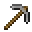
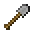
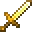

---
<!-- golden_axe__from__smithing__use__stone_axe.md -->

<!-- zh_tw -->

## 金斧 | 鍛造台 | 石斧

<table>
	<tablebody>
		<tr>
			<td colspan="5">鍛造台</td>
		</tr>
		<tr>
			<td></td>
			<td></td>
			<td></td>
			<td></td>
			<td></td>
		</tr>
	</tablebody>
</table>
<table>
	<tablebody>
		<tr>
			<td></td>
			<td>圖示</td>
			<td>名稱</td>
			<td>標簽</td>
			<td>數量</td>
		</tr>
		<tr>
			<td></td>
			<td></td>
			<td>石斧</td>
			<td>stone_axe</td>
			<td>1</td>
		</tr>
		<tr>
			<td></td>
			<td></td>
			<td>金錠</td>
			<td>gold_ingot</td>
			<td>1</td>
		</tr>
		<tr>
			<td></td>
			<td></td>
			<td>金斧</td>
			<td>golden_axe</td>
			<td>1</td>
		</tr>
	</tablebody>
</table>

---
<!-- golden_hoe__from__smithing__use__stone_hoe.md -->

<!-- zh_tw -->

## 金鋤 | 鍛造台 | 石鋤

<table>
	<tablebody>
		<tr>
			<td colspan="5">鍛造台</td>
		</tr>
		<tr>
			<td></td>
			<td></td>
			<td></td>
			<td></td>
			<td></td>
		</tr>
	</tablebody>
</table>
<table>
	<tablebody>
		<tr>
			<td></td>
			<td>圖示</td>
			<td>名稱</td>
			<td>標簽</td>
			<td>數量</td>
		</tr>
		<tr>
			<td></td>
			<td></td>
			<td>石鋤</td>
			<td>stone_hoe</td>
			<td>1</td>
		</tr>
		<tr>
			<td></td>
			<td></td>
			<td>金錠</td>
			<td>gold_ingot</td>
			<td>1</td>
		</tr>
		<tr>
			<td></td>
			<td></td>
			<td>金鋤</td>
			<td>golden_hoe</td>
			<td>1</td>
		</tr>
	</tablebody>
</table>

---
<!-- golden_pickaxe__from__smithing__use__stone_pickaxe.md -->

<!-- zh_tw -->

## 金鎬 | 鍛造台 | 石鎬

<table>
	<tablebody>
		<tr>
			<td colspan="5">鍛造台</td>
		</tr>
		<tr>
			<td></td>
			<td></td>
			<td></td>
			<td></td>
			<td></td>
		</tr>
	</tablebody>
</table>
<table>
	<tablebody>
		<tr>
			<td></td>
			<td>圖示</td>
			<td>名稱</td>
			<td>標簽</td>
			<td>數量</td>
		</tr>
		<tr>
			<td></td>
			<td></td>
			<td>石鎬</td>
			<td>stone_pickaxe</td>
			<td>1</td>
		</tr>
		<tr>
			<td></td>
			<td></td>
			<td>金錠</td>
			<td>gold_ingot</td>
			<td>1</td>
		</tr>
		<tr>
			<td></td>
			<td></td>
			<td>金鎬</td>
			<td>golden_pickaxe</td>
			<td>1</td>
		</tr>
	</tablebody>
</table>

---
<!-- golden_shovel__from__smithing__use__stone_shovel.md -->

<!-- zh_tw -->

## 金鏟 | 鍛造台 | 石鏟

<table>
	<tablebody>
		<tr>
			<td colspan="5">鍛造台</td>
		</tr>
		<tr>
			<td></td>
			<td></td>
			<td></td>
			<td></td>
			<td></td>
		</tr>
	</tablebody>
</table>
<table>
	<tablebody>
		<tr>
			<td></td>
			<td>圖示</td>
			<td>名稱</td>
			<td>標簽</td>
			<td>數量</td>
		</tr>
		<tr>
			<td></td>
			<td></td>
			<td>石鏟</td>
			<td>stone_shovel</td>
			<td>1</td>
		</tr>
		<tr>
			<td></td>
			<td></td>
			<td>金錠</td>
			<td>gold_ingot</td>
			<td>1</td>
		</tr>
		<tr>
			<td></td>
			<td></td>
			<td>金鏟</td>
			<td>golden_shovel</td>
			<td>1</td>
		</tr>
	</tablebody>
</table>

---
<!-- golden_sword__from__smithing__use__stone_sword.md -->

<!-- zh_tw -->

## 金劍 | 鍛造台 | 石劍

<table>
	<tablebody>
		<tr>
			<td colspan="5">鍛造台</td>
		</tr>
		<tr>
			<td></td>
			<td></td>
			<td></td>
			<td></td>
			<td></td>
		</tr>
	</tablebody>
</table>
<table>
	<tablebody>
		<tr>
			<td></td>
			<td>圖示</td>
			<td>名稱</td>
			<td>標簽</td>
			<td>數量</td>
		</tr>
		<tr>
			<td></td>
			<td></td>
			<td>石劍</td>
			<td>stone_sword</td>
			<td>1</td>
		</tr>
		<tr>
			<td></td>
			<td></td>
			<td>金錠</td>
			<td>gold_ingot</td>
			<td>1</td>
		</tr>
		<tr>
			<td></td>
			<td></td>
			<td>金劍</td>
			<td>golden_sword</td>
			<td>1</td>
		</tr>
	</tablebody>
</table>

