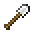

---
<!-- iron_axe__from__smithing__use__golden_axe.md -->

<!-- zh_tw -->

## 鐵斧 | 鍛造台 | 金斧

<table>
	<tablebody>
		<tr>
			<td colspan="5">鍛造台</td>
		</tr>
		<tr>
			<td></td>
			<td></td>
			<td></td>
			<td></td>
			<td></td>
		</tr>
	</tablebody>
</table>
<table>
	<tablebody>
		<tr>
			<td></td>
			<td>圖示</td>
			<td>名稱</td>
			<td>標簽</td>
			<td>數量</td>
		</tr>
		<tr>
			<td></td>
			<td></td>
			<td>金斧</td>
			<td>golden_axe</td>
			<td>1</td>
		</tr>
		<tr>
			<td></td>
			<td></td>
			<td>鐵錠</td>
			<td>iron_ingot</td>
			<td>1</td>
		</tr>
		<tr>
			<td></td>
			<td></td>
			<td>鐵斧</td>
			<td>iron_axe</td>
			<td>1</td>
		</tr>
	</tablebody>
</table>

---
<!-- iron_hoe__from__smithing__use__golden_hoe.md -->

<!-- zh_tw -->

## 鐵鋤 | 鍛造台 | 金鋤

<table>
	<tablebody>
		<tr>
			<td colspan="5">鍛造台</td>
		</tr>
		<tr>
			<td></td>
			<td></td>
			<td></td>
			<td></td>
			<td></td>
		</tr>
	</tablebody>
</table>
<table>
	<tablebody>
		<tr>
			<td></td>
			<td>圖示</td>
			<td>名稱</td>
			<td>標簽</td>
			<td>數量</td>
		</tr>
		<tr>
			<td></td>
			<td></td>
			<td>金鋤</td>
			<td>golden_hoe</td>
			<td>1</td>
		</tr>
		<tr>
			<td></td>
			<td></td>
			<td>鐵錠</td>
			<td>iron_ingot</td>
			<td>1</td>
		</tr>
		<tr>
			<td></td>
			<td></td>
			<td>鐵鋤</td>
			<td>iron_hoe</td>
			<td>1</td>
		</tr>
	</tablebody>
</table>

---
<!-- iron_pickaxe__from__smithing__use__golden_pickaxe.md -->

<!-- zh_tw -->

## 鐵鎬 | 鍛造台 | 金鎬

<table>
	<tablebody>
		<tr>
			<td colspan="5">鍛造台</td>
		</tr>
		<tr>
			<td></td>
			<td></td>
			<td></td>
			<td></td>
			<td></td>
		</tr>
	</tablebody>
</table>
<table>
	<tablebody>
		<tr>
			<td></td>
			<td>圖示</td>
			<td>名稱</td>
			<td>標簽</td>
			<td>數量</td>
		</tr>
		<tr>
			<td></td>
			<td></td>
			<td>金鎬</td>
			<td>golden_pickaxe</td>
			<td>1</td>
		</tr>
		<tr>
			<td></td>
			<td></td>
			<td>鐵錠</td>
			<td>iron_ingot</td>
			<td>1</td>
		</tr>
		<tr>
			<td></td>
			<td></td>
			<td>鐵鎬</td>
			<td>iron_pickaxe</td>
			<td>1</td>
		</tr>
	</tablebody>
</table>

---
<!-- iron_shovel__from__smithing__use__golden_shovel.md -->

<!-- zh_tw -->

## 鐵鏟 | 鍛造台 | 金鏟

<table>
	<tablebody>
		<tr>
			<td colspan="5">鍛造台</td>
		</tr>
		<tr>
			<td></td>
			<td></td>
			<td></td>
			<td></td>
			<td></td>
		</tr>
	</tablebody>
</table>
<table>
	<tablebody>
		<tr>
			<td></td>
			<td>圖示</td>
			<td>名稱</td>
			<td>標簽</td>
			<td>數量</td>
		</tr>
		<tr>
			<td></td>
			<td></td>
			<td>金鏟</td>
			<td>golden_shovel</td>
			<td>1</td>
		</tr>
		<tr>
			<td></td>
			<td></td>
			<td>鐵錠</td>
			<td>iron_ingot</td>
			<td>1</td>
		</tr>
		<tr>
			<td></td>
			<td></td>
			<td>鐵鏟</td>
			<td>iron_shovel</td>
			<td>1</td>
		</tr>
	</tablebody>
</table>

---
<!-- iron_sword__from__smithing__use__golden_sword.md -->

<!-- zh_tw -->

## 鐵劍 | 鍛造台 | 金劍

<table>
	<tablebody>
		<tr>
			<td colspan="5">鍛造台</td>
		</tr>
		<tr>
			<td></td>
			<td></td>
			<td></td>
			<td></td>
			<td></td>
		</tr>
	</tablebody>
</table>
<table>
	<tablebody>
		<tr>
			<td></td>
			<td>圖示</td>
			<td>名稱</td>
			<td>標簽</td>
			<td>數量</td>
		</tr>
		<tr>
			<td></td>
			<td></td>
			<td>金劍</td>
			<td>golden_sword</td>
			<td>1</td>
		</tr>
		<tr>
			<td></td>
			<td></td>
			<td>鐵錠</td>
			<td>iron_ingot</td>
			<td>1</td>
		</tr>
		<tr>
			<td></td>
			<td></td>
			<td>鐵劍</td>
			<td>iron_sword</td>
			<td>1</td>
		</tr>
	</tablebody>
</table>

