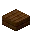
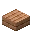
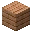
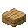
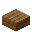
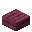

---
<!-- acacia_planks__from__crafting_shapeless__use__acacia_slab.md -->

<!-- zh_tw -->

## 相思木材 | 工作台：無序 | 相思木半磚

<table>
	<tablebody>
		<tr>
			<td colspan="5">工作台：無序</td>
		</tr>
		<tr>
			<td></td>
			<td></td>
			<td></td>
			<td colspan="2"></td>
		</tr>
		<tr>
			<td></td>
			<td></td>
			<td></td>
			<td></td>
			<td></td>
		</tr>
		<tr>
			<td></td>
			<td></td>
			<td></td>
			<td colspan="2"></td>
		</tr>
	</tablebody>
</table>
<table>
	<tablebody>
		<tr>
			<td></td>
			<td>圖示</td>
			<td>名稱</td>
			<td>標簽</td>
			<td>數量</td>
		</tr>
		<tr>
			<td></td>
			<td></td>
			<td>相思木材</td>
			<td>acacia_planks</td>
			<td>1</td>
		</tr>
		<tr>
			<td></td>
			<td></td>
			<td>相思木半磚</td>
			<td>acacia_slab</td>
			<td>1</td>
		</tr>
		<tr>
			<td></td>
			<td></td>
			<td>相思木半磚</td>
			<td>acacia_slab</td>
			<td>1</td>
		</tr>
	</tablebody>
</table>

---
<!-- birch_planks__from__crafting_shapeless__use__birch_slab.md -->

<!-- zh_tw -->

## 樺木材 | 工作台：無序 | 樺木半磚

<table>
	<tablebody>
		<tr>
			<td colspan="5">工作台：無序</td>
		</tr>
		<tr>
			<td></td>
			<td></td>
			<td></td>
			<td colspan="2"></td>
		</tr>
		<tr>
			<td></td>
			<td></td>
			<td></td>
			<td></td>
			<td></td>
		</tr>
		<tr>
			<td></td>
			<td></td>
			<td></td>
			<td colspan="2"></td>
		</tr>
	</tablebody>
</table>
<table>
	<tablebody>
		<tr>
			<td></td>
			<td>圖示</td>
			<td>名稱</td>
			<td>標簽</td>
			<td>數量</td>
		</tr>
		<tr>
			<td></td>
			<td></td>
			<td>樺木材</td>
			<td>birch_planks</td>
			<td>1</td>
		</tr>
		<tr>
			<td></td>
			<td></td>
			<td>樺木半磚</td>
			<td>birch_slab</td>
			<td>1</td>
		</tr>
		<tr>
			<td></td>
			<td></td>
			<td>樺木半磚</td>
			<td>birch_slab</td>
			<td>1</td>
		</tr>
	</tablebody>
</table>

---
<!-- dark_oak_planks__from__crafting_shapeless__use__dark_oak_slab.md -->

<!-- zh_tw -->

## 黑橡木材 | 工作台：無序 | 黑橡木半磚

<table>
	<tablebody>
		<tr>
			<td colspan="5">工作台：無序</td>
		</tr>
		<tr>
			<td></td>
			<td></td>
			<td></td>
			<td colspan="2"></td>
		</tr>
		<tr>
			<td></td>
			<td></td>
			<td></td>
			<td></td>
			<td></td>
		</tr>
		<tr>
			<td></td>
			<td></td>
			<td></td>
			<td colspan="2"></td>
		</tr>
	</tablebody>
</table>
<table>
	<tablebody>
		<tr>
			<td></td>
			<td>圖示</td>
			<td>名稱</td>
			<td>標簽</td>
			<td>數量</td>
		</tr>
		<tr>
			<td></td>
			<td></td>
			<td>黑橡木材</td>
			<td>dark_oak_planks</td>
			<td>1</td>
		</tr>
		<tr>
			<td></td>
			<td></td>
			<td>黑橡木半磚</td>
			<td>dark_oak_slab</td>
			<td>1</td>
		</tr>
		<tr>
			<td></td>
			<td></td>
			<td>黑橡木半磚</td>
			<td>dark_oak_slab</td>
			<td>1</td>
		</tr>
	</tablebody>
</table>

---
<!-- jungle_planks__from__crafting_shapeless__use__jungle_slab.md -->

<!-- zh_tw -->

## 叢林木材 | 工作台：無序 | 叢林木半磚

<table>
	<tablebody>
		<tr>
			<td colspan="5">工作台：無序</td>
		</tr>
		<tr>
			<td></td>
			<td></td>
			<td></td>
			<td colspan="2"></td>
		</tr>
		<tr>
			<td></td>
			<td></td>
			<td></td>
			<td></td>
			<td></td>
		</tr>
		<tr>
			<td></td>
			<td></td>
			<td></td>
			<td colspan="2"></td>
		</tr>
	</tablebody>
</table>
<table>
	<tablebody>
		<tr>
			<td></td>
			<td>圖示</td>
			<td>名稱</td>
			<td>標簽</td>
			<td>數量</td>
		</tr>
		<tr>
			<td></td>
			<td></td>
			<td>叢林木材</td>
			<td>jungle_planks</td>
			<td>1</td>
		</tr>
		<tr>
			<td></td>
			<td></td>
			<td>叢林木半磚</td>
			<td>jungle_slab</td>
			<td>1</td>
		</tr>
		<tr>
			<td></td>
			<td></td>
			<td>叢林木半磚</td>
			<td>jungle_slab</td>
			<td>1</td>
		</tr>
	</tablebody>
</table>

---
<!-- oak_planks__from__crafting_shapeless__use__oak_slab.md -->

<!-- zh_tw -->

## 橡木材 | 工作台：無序 | 橡木半磚

<table>
	<tablebody>
		<tr>
			<td colspan="5">工作台：無序</td>
		</tr>
		<tr>
			<td></td>
			<td></td>
			<td></td>
			<td colspan="2"></td>
		</tr>
		<tr>
			<td></td>
			<td></td>
			<td></td>
			<td></td>
			<td></td>
		</tr>
		<tr>
			<td></td>
			<td></td>
			<td></td>
			<td colspan="2"></td>
		</tr>
	</tablebody>
</table>
<table>
	<tablebody>
		<tr>
			<td></td>
			<td>圖示</td>
			<td>名稱</td>
			<td>標簽</td>
			<td>數量</td>
		</tr>
		<tr>
			<td></td>
			<td></td>
			<td>橡木材</td>
			<td>oak_planks</td>
			<td>1</td>
		</tr>
		<tr>
			<td></td>
			<td></td>
			<td>橡木半磚</td>
			<td>oak_slab</td>
			<td>1</td>
		</tr>
		<tr>
			<td></td>
			<td></td>
			<td>橡木半磚</td>
			<td>oak_slab</td>
			<td>1</td>
		</tr>
	</tablebody>
</table>

---
<!-- spruce_planks__from__crafting_shapeless__use__spruce_slab.md -->

<!-- zh_tw -->

## 杉木材 | 工作台：無序 | 杉木半磚

<table>
	<tablebody>
		<tr>
			<td colspan="5">工作台：無序</td>
		</tr>
		<tr>
			<td></td>
			<td></td>
			<td></td>
			<td colspan="2"></td>
		</tr>
		<tr>
			<td></td>
			<td></td>
			<td></td>
			<td></td>
			<td></td>
		</tr>
		<tr>
			<td></td>
			<td></td>
			<td></td>
			<td colspan="2"></td>
		</tr>
	</tablebody>
</table>
<table>
	<tablebody>
		<tr>
			<td></td>
			<td>圖示</td>
			<td>名稱</td>
			<td>標簽</td>
			<td>數量</td>
		</tr>
		<tr>
			<td></td>
			<td></td>
			<td>杉木材</td>
			<td>spruce_planks</td>
			<td>1</td>
		</tr>
		<tr>
			<td></td>
			<td></td>
			<td>杉木半磚</td>
			<td>spruce_slab</td>
			<td>1</td>
		</tr>
		<tr>
			<td></td>
			<td></td>
			<td>杉木半磚</td>
			<td>spruce_slab</td>
			<td>1</td>
		</tr>
	</tablebody>
</table>

---
<!-- crimson_planks__from__crafting_shapeless__use__crimson_slab.md -->

<!-- zh_tw -->

## 緋紅蕈木材 | 工作台：無序 | 緋紅蕈木半磚

<table>
	<tablebody>
		<tr>
			<td colspan="5">工作台：無序</td>
		</tr>
		<tr>
			<td></td>
			<td></td>
			<td></td>
			<td colspan="2"></td>
		</tr>
		<tr>
			<td></td>
			<td></td>
			<td></td>
			<td></td>
			<td></td>
		</tr>
		<tr>
			<td></td>
			<td></td>
			<td></td>
			<td colspan="2"></td>
		</tr>
	</tablebody>
</table>
<table>
	<tablebody>
		<tr>
			<td></td>
			<td>圖示</td>
			<td>名稱</td>
			<td>標簽</td>
			<td>數量</td>
		</tr>
		<tr>
			<td></td>
			<td></td>
			<td>緋紅蕈木材</td>
			<td>crimson_planks</td>
			<td>1</td>
		</tr>
		<tr>
			<td></td>
			<td></td>
			<td>緋紅蕈木半磚</td>
			<td>crimson_slab</td>
			<td>1</td>
		</tr>
		<tr>
			<td></td>
			<td></td>
			<td>緋紅蕈木半磚</td>
			<td>crimson_slab</td>
			<td>1</td>
		</tr>
	</tablebody>
</table>

---
<!-- warped_planks__from__crafting_shapeless__use__warped_slab.md -->

<!-- zh_tw -->

## 扭曲蕈木材 | 工作台：無序 | 扭曲蕈木半磚

<table>
	<tablebody>
		<tr>
			<td colspan="5">工作台：無序</td>
		</tr>
		<tr>
			<td></td>
			<td></td>
			<td></td>
			<td colspan="2"></td>
		</tr>
		<tr>
			<td></td>
			<td></td>
			<td></td>
			<td></td>
			<td></td>
		</tr>
		<tr>
			<td></td>
			<td></td>
			<td></td>
			<td colspan="2"></td>
		</tr>
	</tablebody>
</table>
<table>
	<tablebody>
		<tr>
			<td></td>
			<td>圖示</td>
			<td>名稱</td>
			<td>標簽</td>
			<td>數量</td>
		</tr>
		<tr>
			<td></td>
			<td></td>
			<td>扭曲蕈木材</td>
			<td>warped_planks</td>
			<td>1</td>
		</tr>
		<tr>
			<td></td>
			<td></td>
			<td>扭曲蕈木半磚</td>
			<td>warped_slab</td>
			<td>1</td>
		</tr>
		<tr>
			<td></td>
			<td></td>
			<td>扭曲蕈木半磚</td>
			<td>warped_slab</td>
			<td>1</td>
		</tr>
	</tablebody>
</table>

