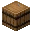
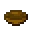
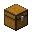
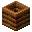
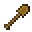
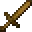
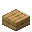

---
<!-- stick__from__crafting_shapeless__use__barrel.md -->

<!-- zh_tw -->

## 木棒 | 工作台：無序 | 木桶

<table>
	<tablebody>
		<tr>
			<td colspan="5">工作台：無序</td>
		</tr>
		<tr>
			<td></td>
			<td></td>
			<td></td>
			<td colspan="2"></td>
		</tr>
		<tr>
			<td></td>
			<td></td>
			<td></td>
			<td></td>
			<td></td>
		</tr>
		<tr>
			<td></td>
			<td></td>
			<td></td>
			<td colspan="2"></td>
		</tr>
	</tablebody>
</table>
<table>
	<tablebody>
		<tr>
			<td></td>
			<td>圖示</td>
			<td>名稱</td>
			<td>標簽</td>
			<td>數量</td>
		</tr>
		<tr>
			<td></td>
			<td></td>
			<td>木棒</td>
			<td>stick</td>
			<td>8</td>
		</tr>
		<tr>
			<td></td>
			<td></td>
			<td>木桶</td>
			<td>barrel</td>
			<td>1</td>
		</tr>
	</tablebody>
</table>

---
<!-- stick__from__crafting_shapeless__use__bowl.md -->

<!-- zh_tw -->

## 木棒 | 工作台：無序 | 碗

<table>
	<tablebody>
		<tr>
			<td colspan="5">工作台：無序</td>
		</tr>
		<tr>
			<td></td>
			<td></td>
			<td></td>
			<td colspan="2"></td>
		</tr>
		<tr>
			<td></td>
			<td></td>
			<td></td>
			<td></td>
			<td></td>
		</tr>
		<tr>
			<td></td>
			<td></td>
			<td></td>
			<td colspan="2"></td>
		</tr>
	</tablebody>
</table>
<table>
	<tablebody>
		<tr>
			<td></td>
			<td>圖示</td>
			<td>名稱</td>
			<td>標簽</td>
			<td>數量</td>
		</tr>
		<tr>
			<td></td>
			<td></td>
			<td>木棒</td>
			<td>stick</td>
			<td>1</td>
		</tr>
		<tr>
			<td></td>
			<td></td>
			<td>碗</td>
			<td>bowl</td>
			<td>1</td>
		</tr>
	</tablebody>
</table>

---
<!-- stick__from__crafting_shapeless__use__chest.md -->

<!-- zh_tw -->

## 木棒 | 工作台：無序 | 儲物箱

<table>
	<tablebody>
		<tr>
			<td colspan="5">工作台：無序</td>
		</tr>
		<tr>
			<td></td>
			<td></td>
			<td></td>
			<td colspan="2"></td>
		</tr>
		<tr>
			<td></td>
			<td></td>
			<td></td>
			<td></td>
			<td></td>
		</tr>
		<tr>
			<td></td>
			<td></td>
			<td></td>
			<td colspan="2"></td>
		</tr>
	</tablebody>
</table>
<table>
	<tablebody>
		<tr>
			<td></td>
			<td>圖示</td>
			<td>名稱</td>
			<td>標簽</td>
			<td>數量</td>
		</tr>
		<tr>
			<td></td>
			<td></td>
			<td>木棒</td>
			<td>stick</td>
			<td>16</td>
		</tr>
		<tr>
			<td></td>
			<td></td>
			<td>儲物箱</td>
			<td>chest</td>
			<td>1</td>
		</tr>
	</tablebody>
</table>

---
<!-- stick__from__crafting_shapeless__use__composter.md -->

<!-- zh_tw -->

## 木棒 | 工作台：無序 | 堆肥箱

<table>
	<tablebody>
		<tr>
			<td colspan="5">工作台：無序</td>
		</tr>
		<tr>
			<td></td>
			<td></td>
			<td></td>
			<td colspan="2"></td>
		</tr>
		<tr>
			<td></td>
			<td></td>
			<td></td>
			<td></td>
			<td></td>
		</tr>
		<tr>
			<td></td>
			<td></td>
			<td></td>
			<td colspan="2"></td>
		</tr>
	</tablebody>
</table>
<table>
	<tablebody>
		<tr>
			<td></td>
			<td>圖示</td>
			<td>名稱</td>
			<td>標簽</td>
			<td>數量</td>
		</tr>
		<tr>
			<td></td>
			<td></td>
			<td>木棒</td>
			<td>stick</td>
			<td>7</td>
		</tr>
		<tr>
			<td></td>
			<td></td>
			<td>堆肥箱</td>
			<td>composter</td>
			<td>1</td>
		</tr>
	</tablebody>
</table>

---
<!-- stick__from__crafting_shapeless__use__crafting_table.md -->

<!-- zh_tw -->

## 木棒 | 工作台：無序 | 工作台

<table>
	<tablebody>
		<tr>
			<td colspan="5">工作台：無序</td>
		</tr>
		<tr>
			<td></td>
			<td></td>
			<td></td>
			<td colspan="2"></td>
		</tr>
		<tr>
			<td></td>
			<td></td>
			<td></td>
			<td></td>
			<td></td>
		</tr>
		<tr>
			<td></td>
			<td></td>
			<td></td>
			<td colspan="2"></td>
		</tr>
	</tablebody>
</table>
<table>
	<tablebody>
		<tr>
			<td></td>
			<td>圖示</td>
			<td>名稱</td>
			<td>標簽</td>
			<td>數量</td>
		</tr>
		<tr>
			<td></td>
			<td></td>
			<td>木棒</td>
			<td>stick</td>
			<td>8</td>
		</tr>
		<tr>
			<td></td>
			<td></td>
			<td>工作台</td>
			<td>crafting_table</td>
			<td>1</td>
		</tr>
	</tablebody>
</table>

---
<!-- stick__from__crafting_shapeless__use__ladder.md -->

<!-- zh_tw -->

## 木棒 | 工作台：無序 | 梯子

<table>
	<tablebody>
		<tr>
			<td colspan="5">工作台：無序</td>
		</tr>
		<tr>
			<td></td>
			<td></td>
			<td></td>
			<td colspan="2"></td>
		</tr>
		<tr>
			<td></td>
			<td></td>
			<td></td>
			<td></td>
			<td></td>
		</tr>
		<tr>
			<td></td>
			<td></td>
			<td></td>
			<td colspan="2"></td>
		</tr>
	</tablebody>
</table>
<table>
	<tablebody>
		<tr>
			<td></td>
			<td>圖示</td>
			<td>名稱</td>
			<td>標簽</td>
			<td>數量</td>
		</tr>
		<tr>
			<td></td>
			<td></td>
			<td>木棒</td>
			<td>stick</td>
			<td>2</td>
		</tr>
		<tr>
			<td></td>
			<td></td>
			<td>梯子</td>
			<td>ladder</td>
			<td>1</td>
		</tr>
	</tablebody>
</table>

---
<!-- stick__from__crafting_shapeless__use__wooden_axe.md -->

<!-- zh_tw -->

## 木棒 | 工作台：無序 | 木斧

<table>
	<tablebody>
		<tr>
			<td colspan="5">工作台：無序</td>
		</tr>
		<tr>
			<td></td>
			<td></td>
			<td></td>
			<td colspan="2"></td>
		</tr>
		<tr>
			<td></td>
			<td></td>
			<td></td>
			<td></td>
			<td></td>
		</tr>
		<tr>
			<td></td>
			<td></td>
			<td></td>
			<td colspan="2"></td>
		</tr>
	</tablebody>
</table>
<table>
	<tablebody>
		<tr>
			<td></td>
			<td>圖示</td>
			<td>名稱</td>
			<td>標簽</td>
			<td>數量</td>
		</tr>
		<tr>
			<td></td>
			<td></td>
			<td>木棒</td>
			<td>stick</td>
			<td>8</td>
		</tr>
		<tr>
			<td></td>
			<td></td>
			<td>木斧</td>
			<td>wooden_axe</td>
			<td>1</td>
		</tr>
	</tablebody>
</table>

---
<!-- stick__from__crafting_shapeless__use__wooden_hoe.md -->

<!-- zh_tw -->

## 木棒 | 工作台：無序 | 木鋤

<table>
	<tablebody>
		<tr>
			<td colspan="5">工作台：無序</td>
		</tr>
		<tr>
			<td></td>
			<td></td>
			<td></td>
			<td colspan="2"></td>
		</tr>
		<tr>
			<td></td>
			<td></td>
			<td></td>
			<td></td>
			<td></td>
		</tr>
		<tr>
			<td></td>
			<td></td>
			<td></td>
			<td colspan="2"></td>
		</tr>
	</tablebody>
</table>
<table>
	<tablebody>
		<tr>
			<td></td>
			<td>圖示</td>
			<td>名稱</td>
			<td>標簽</td>
			<td>數量</td>
		</tr>
		<tr>
			<td></td>
			<td></td>
			<td>木棒</td>
			<td>stick</td>
			<td>6</td>
		</tr>
		<tr>
			<td></td>
			<td></td>
			<td>木鋤</td>
			<td>wooden_hoe</td>
			<td>1</td>
		</tr>
	</tablebody>
</table>

---
<!-- stick__from__crafting_shapeless__use__wooden_pickaxe.md -->

<!-- zh_tw -->

## 木棒 | 工作台：無序 | 木鎬

<table>
	<tablebody>
		<tr>
			<td colspan="5">工作台：無序</td>
		</tr>
		<tr>
			<td></td>
			<td></td>
			<td></td>
			<td colspan="2"></td>
		</tr>
		<tr>
			<td></td>
			<td></td>
			<td></td>
			<td></td>
			<td></td>
		</tr>
		<tr>
			<td></td>
			<td></td>
			<td></td>
			<td colspan="2"></td>
		</tr>
	</tablebody>
</table>
<table>
	<tablebody>
		<tr>
			<td></td>
			<td>圖示</td>
			<td>名稱</td>
			<td>標簽</td>
			<td>數量</td>
		</tr>
		<tr>
			<td></td>
			<td></td>
			<td>木棒</td>
			<td>stick</td>
			<td>8</td>
		</tr>
		<tr>
			<td></td>
			<td></td>
			<td>木鎬</td>
			<td>wooden_pickaxe</td>
			<td>1</td>
		</tr>
	</tablebody>
</table>

---
<!-- stick__from__crafting_shapeless__use__wooden_shovel.md -->

<!-- zh_tw -->

## 木棒 | 工作台：無序 | 木鏟

<table>
	<tablebody>
		<tr>
			<td colspan="5">工作台：無序</td>
		</tr>
		<tr>
			<td></td>
			<td></td>
			<td></td>
			<td colspan="2"></td>
		</tr>
		<tr>
			<td></td>
			<td></td>
			<td></td>
			<td></td>
			<td></td>
		</tr>
		<tr>
			<td></td>
			<td></td>
			<td></td>
			<td colspan="2"></td>
		</tr>
	</tablebody>
</table>
<table>
	<tablebody>
		<tr>
			<td></td>
			<td>圖示</td>
			<td>名稱</td>
			<td>標簽</td>
			<td>數量</td>
		</tr>
		<tr>
			<td></td>
			<td></td>
			<td>木棒</td>
			<td>stick</td>
			<td>4</td>
		</tr>
		<tr>
			<td></td>
			<td></td>
			<td>木鏟</td>
			<td>wooden_shovel</td>
			<td>1</td>
		</tr>
	</tablebody>
</table>

---
<!-- stick__from__crafting_shapeless__use__wooden_sword.md -->

<!-- zh_tw -->

## 木棒 | 工作台：無序 | 木劍

<table>
	<tablebody>
		<tr>
			<td colspan="5">工作台：無序</td>
		</tr>
		<tr>
			<td></td>
			<td></td>
			<td></td>
			<td colspan="2"></td>
		</tr>
		<tr>
			<td></td>
			<td></td>
			<td></td>
			<td></td>
			<td></td>
		</tr>
		<tr>
			<td></td>
			<td></td>
			<td></td>
			<td colspan="2"></td>
		</tr>
	</tablebody>
</table>
<table>
	<tablebody>
		<tr>
			<td></td>
			<td>圖示</td>
			<td>名稱</td>
			<td>標簽</td>
			<td>數量</td>
		</tr>
		<tr>
			<td></td>
			<td></td>
			<td>木棒</td>
			<td>stick</td>
			<td>5</td>
		</tr>
		<tr>
			<td></td>
			<td></td>
			<td>木劍</td>
			<td>wooden_sword</td>
			<td>1</td>
		</tr>
	</tablebody>
</table>

---
<!-- stick__from__crafting_shapeless__use__tag_wooden_slabs.md -->

<!-- zh_tw -->

## 木棒 | 工作台：無序 | 木半磚

<table>
	<tablebody>
		<tr>
			<td colspan="5">工作台：無序</td>
		</tr>
		<tr>
			<td></td>
			<td></td>
			<td></td>
			<td colspan="2"></td>
		</tr>
		<tr>
			<td></td>
			<td></td>
			<td></td>
			<td></td>
			<td></td>
		</tr>
		<tr>
			<td></td>
			<td></td>
			<td></td>
			<td colspan="2"></td>
		</tr>
	</tablebody>
</table>
<table>
	<tablebody>
		<tr>
			<td></td>
			<td>圖示</td>
			<td>名稱</td>
			<td>標簽</td>
			<td>數量</td>
		</tr>
		<tr>
			<td></td>
			<td></td>
			<td>木棒</td>
			<td>stick</td>
			<td>1</td>
		</tr>
		<tr>
			<td></td>
			<td></td>
			<td><a>木半磚</a></td>
			<td><a>wooden_slabs</a></td>
			<td>1</td>
		</tr>
	</tablebody>
</table>

[木半磚](../../../zh_tw/tags/tag__wooden_slabs.md)

