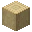
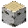
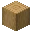
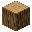

---
<!-- stripped_acacia_log__from__stonecutting__use__acacia_log.md -->

<!-- zh_tw -->

## 剝皮相思木原木 | 切石機 | 相思木原木

<table>
	<tablebody>
		<tr>
			<td colspan="6">切石機</td>
		</tr>
		<tr>
			<td colspan="2"></td>
			<td></td>
			<td></td>
			<td></td>
			<td></td>
		</tr>
		<tr>
			<td></td>
			<td></td>
			<td></td>
			<td></td>
			<td></td>
			<td></td>
		</tr>
		<tr>
			<td colspan="2"></td>
			<td></td>
			<td></td>
			<td></td>
			<td></td>
		</tr>
	</tablebody>
</table>
<table>
	<tablebody>
		<tr>
			<td></td>
			<td>圖示</td>
			<td>名稱</td>
			<td>標簽</td>
			<td>數量</td>
		</tr>
		<tr>
			<td></td>
			<td></td>
			<td>相思木原木</td>
			<td>acacia_log</td>
			<td>1</td>
		</tr>
		<tr>
			<td></td>
			<td></td>
			<td>剝皮相思木原木</td>
			<td>stripped_acacia_log</td>
			<td>1</td>
		</tr>
	</tablebody>
</table>

---
<!-- stripped_birch_log__from__stonecutting__use__birch_log.md -->

<!-- zh_tw -->

## 剝皮樺木原木 | 切石機 | 樺木原木

<table>
	<tablebody>
		<tr>
			<td colspan="6">切石機</td>
		</tr>
		<tr>
			<td colspan="2"></td>
			<td></td>
			<td></td>
			<td></td>
			<td></td>
		</tr>
		<tr>
			<td></td>
			<td></td>
			<td></td>
			<td></td>
			<td></td>
			<td></td>
		</tr>
		<tr>
			<td colspan="2"></td>
			<td></td>
			<td></td>
			<td></td>
			<td></td>
		</tr>
	</tablebody>
</table>
<table>
	<tablebody>
		<tr>
			<td></td>
			<td>圖示</td>
			<td>名稱</td>
			<td>標簽</td>
			<td>數量</td>
		</tr>
		<tr>
			<td></td>
			<td></td>
			<td>樺木原木</td>
			<td>birch_log</td>
			<td>1</td>
		</tr>
		<tr>
			<td></td>
			<td></td>
			<td>剝皮樺木原木</td>
			<td>stripped_birch_log</td>
			<td>1</td>
		</tr>
	</tablebody>
</table>

---
<!-- stripped_dark_oak_log__from__stonecutting__use__dark_oak_log.md -->

<!-- zh_tw -->

## 剝皮黑橡木原木 | 切石機 | 黑橡木原木

<table>
	<tablebody>
		<tr>
			<td colspan="6">切石機</td>
		</tr>
		<tr>
			<td colspan="2"></td>
			<td></td>
			<td></td>
			<td></td>
			<td></td>
		</tr>
		<tr>
			<td></td>
			<td></td>
			<td></td>
			<td></td>
			<td></td>
			<td></td>
		</tr>
		<tr>
			<td colspan="2"></td>
			<td></td>
			<td></td>
			<td></td>
			<td></td>
		</tr>
	</tablebody>
</table>
<table>
	<tablebody>
		<tr>
			<td></td>
			<td>圖示</td>
			<td>名稱</td>
			<td>標簽</td>
			<td>數量</td>
		</tr>
		<tr>
			<td></td>
			<td></td>
			<td>黑橡木原木</td>
			<td>dark_oak_log</td>
			<td>1</td>
		</tr>
		<tr>
			<td></td>
			<td></td>
			<td>剝皮黑橡木原木</td>
			<td>stripped_dark_oak_log</td>
			<td>1</td>
		</tr>
	</tablebody>
</table>

---
<!-- stripped_jungle_log__from__stonecutting__use__jungle_log.md -->

<!-- zh_tw -->

## 剝皮叢林木原木 | 切石機 | 叢林木原木

<table>
	<tablebody>
		<tr>
			<td colspan="6">切石機</td>
		</tr>
		<tr>
			<td colspan="2"></td>
			<td></td>
			<td></td>
			<td></td>
			<td></td>
		</tr>
		<tr>
			<td></td>
			<td></td>
			<td></td>
			<td></td>
			<td></td>
			<td></td>
		</tr>
		<tr>
			<td colspan="2"></td>
			<td></td>
			<td></td>
			<td></td>
			<td></td>
		</tr>
	</tablebody>
</table>
<table>
	<tablebody>
		<tr>
			<td></td>
			<td>圖示</td>
			<td>名稱</td>
			<td>標簽</td>
			<td>數量</td>
		</tr>
		<tr>
			<td></td>
			<td></td>
			<td>叢林木原木</td>
			<td>jungle_log</td>
			<td>1</td>
		</tr>
		<tr>
			<td></td>
			<td></td>
			<td>剝皮叢林木原木</td>
			<td>stripped_jungle_log</td>
			<td>1</td>
		</tr>
	</tablebody>
</table>

---
<!-- stripped_oak_log__from__stonecutting__use__oak_log.md -->

<!-- zh_tw -->

## 剝皮橡木原木 | 切石機 | 橡木原木

<table>
	<tablebody>
		<tr>
			<td colspan="6">切石機</td>
		</tr>
		<tr>
			<td colspan="2"></td>
			<td></td>
			<td></td>
			<td></td>
			<td></td>
		</tr>
		<tr>
			<td></td>
			<td></td>
			<td></td>
			<td></td>
			<td></td>
			<td></td>
		</tr>
		<tr>
			<td colspan="2"></td>
			<td></td>
			<td></td>
			<td></td>
			<td></td>
		</tr>
	</tablebody>
</table>
<table>
	<tablebody>
		<tr>
			<td></td>
			<td>圖示</td>
			<td>名稱</td>
			<td>標簽</td>
			<td>數量</td>
		</tr>
		<tr>
			<td></td>
			<td></td>
			<td>橡木原木</td>
			<td>oak_log</td>
			<td>1</td>
		</tr>
		<tr>
			<td></td>
			<td></td>
			<td>剝皮橡木原木</td>
			<td>stripped_oak_log</td>
			<td>1</td>
		</tr>
	</tablebody>
</table>

---
<!-- stripped_spruce_log__from__stonecutting__use__spruce_log.md -->

<!-- zh_tw -->

## 剝皮杉木原木 | 切石機 | 杉木原木

<table>
	<tablebody>
		<tr>
			<td colspan="6">切石機</td>
		</tr>
		<tr>
			<td colspan="2"></td>
			<td></td>
			<td></td>
			<td></td>
			<td></td>
		</tr>
		<tr>
			<td></td>
			<td></td>
			<td></td>
			<td></td>
			<td></td>
			<td></td>
		</tr>
		<tr>
			<td colspan="2"></td>
			<td></td>
			<td></td>
			<td></td>
			<td></td>
		</tr>
	</tablebody>
</table>
<table>
	<tablebody>
		<tr>
			<td></td>
			<td>圖示</td>
			<td>名稱</td>
			<td>標簽</td>
			<td>數量</td>
		</tr>
		<tr>
			<td></td>
			<td></td>
			<td>杉木原木</td>
			<td>spruce_log</td>
			<td>1</td>
		</tr>
		<tr>
			<td></td>
			<td></td>
			<td>剝皮杉木原木</td>
			<td>stripped_spruce_log</td>
			<td>1</td>
		</tr>
	</tablebody>
</table>

---
<!-- stripped_crimson_stem__from__stonecutting__use__crimson_stem.md -->

<!-- zh_tw -->

## 剝皮緋紅蕈柄 | 切石機 | 緋紅蕈柄

<table>
	<tablebody>
		<tr>
			<td colspan="6">切石機</td>
		</tr>
		<tr>
			<td colspan="2"></td>
			<td></td>
			<td></td>
			<td></td>
			<td></td>
		</tr>
		<tr>
			<td></td>
			<td></td>
			<td></td>
			<td></td>
			<td></td>
			<td></td>
		</tr>
		<tr>
			<td colspan="2"></td>
			<td></td>
			<td></td>
			<td></td>
			<td></td>
		</tr>
	</tablebody>
</table>
<table>
	<tablebody>
		<tr>
			<td></td>
			<td>圖示</td>
			<td>名稱</td>
			<td>標簽</td>
			<td>數量</td>
		</tr>
		<tr>
			<td></td>
			<td></td>
			<td>緋紅蕈柄</td>
			<td>crimson_stem</td>
			<td>1</td>
		</tr>
		<tr>
			<td></td>
			<td></td>
			<td>剝皮緋紅蕈柄</td>
			<td>stripped_crimson_stem</td>
			<td>1</td>
		</tr>
	</tablebody>
</table>

---
<!-- stripped_warped_stem__from__stonecutting__use__warped_stem.md -->

<!-- zh_tw -->

## 剝皮扭曲蕈柄 | 切石機 | 扭曲蕈柄

<table>
	<tablebody>
		<tr>
			<td colspan="6">切石機</td>
		</tr>
		<tr>
			<td colspan="2"></td>
			<td></td>
			<td></td>
			<td></td>
			<td></td>
		</tr>
		<tr>
			<td></td>
			<td></td>
			<td></td>
			<td></td>
			<td></td>
			<td></td>
		</tr>
		<tr>
			<td colspan="2"></td>
			<td></td>
			<td></td>
			<td></td>
			<td></td>
		</tr>
	</tablebody>
</table>
<table>
	<tablebody>
		<tr>
			<td></td>
			<td>圖示</td>
			<td>名稱</td>
			<td>標簽</td>
			<td>數量</td>
		</tr>
		<tr>
			<td></td>
			<td></td>
			<td>扭曲蕈柄</td>
			<td>warped_stem</td>
			<td>1</td>
		</tr>
		<tr>
			<td></td>
			<td></td>
			<td>剝皮扭曲蕈柄</td>
			<td>stripped_warped_stem</td>
			<td>1</td>
		</tr>
	</tablebody>
</table>

