---
<!-- acacia_trapdoor__from__stonecutting__use__acacia_planks.md -->

<!-- zh_tw -->

## 相思木地板門 | 切石機 | 相思木材

<table>
	<tablebody>
		<tr>
			<td colspan="6">切石機</td>
		</tr>
		<tr>
			<td colspan="2"></td>
			<td>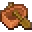</td>
			<td></td>
			<td></td>
			<td>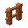</td>
		</tr>
		<tr>
			<td></td>
			<td></td>
			<td>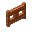</td>
			<td>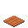</td>
			<td></td>
			<td></td>
		</tr>
		<tr>
			<td colspan="2"></td>
			<td>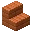</td>
			<td>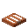</td>
			<td></td>
			<td></td>
		</tr>
	</tablebody>
</table>
<table>
	<tablebody>
		<tr>
			<td></td>
			<td>圖示</td>
			<td>名稱</td>
			<td>標簽</td>
			<td>數量</td>
		</tr>
		<tr>
			<td></td>
			<td></td>
			<td>相思木材</td>
			<td>acacia_planks</td>
			<td>1</td>
		</tr>
		<tr>
			<td></td>
			<td></td>
			<td>相思木船</td>
			<td>acacia_boat</td>
			<td>1</td>
		</tr>
		<tr>
			<td></td>
			<td></td>
			<td>相思木按鈕</td>
			<td>acacia_button</td>
			<td>1</td>
		</tr>
		<tr>
			<td></td>
			<td></td>
			<td>相思木門</td>
			<td>acacia_door</td>
			<td>1</td>
		</tr>
		<tr>
			<td></td>
			<td></td>
			<td>相思木柵欄</td>
			<td>acacia_fence</td>
			<td>1</td>
		</tr>
		<tr>
			<td></td>
			<td></td>
			<td>相思木柵欄門</td>
			<td>acacia_fence_gate</td>
			<td>1</td>
		</tr>
		<tr>
			<td></td>
			<td></td>
			<td>相思木壓力板</td>
			<td>acacia_pressure_plate</td>
			<td>1</td>
		</tr>
		<tr>
			<td></td>
			<td></td>
			<td>相思木告示牌</td>
			<td>acacia_sign</td>
			<td>1</td>
		</tr>
		<tr>
			<td></td>
			<td></td>
			<td>相思木半磚</td>
			<td>acacia_slab</td>
			<td>2</td>
		</tr>
		<tr>
			<td></td>
			<td></td>
			<td>相思木階梯</td>
			<td>acacia_stairs</td>
			<td>1</td>
		</tr>
		<tr>
			<td></td>
			<td></td>
			<td>相思木地板門</td>
			<td>acacia_trapdoor</td>
			<td>1</td>
		</tr>
	</tablebody>
</table>

---
<!-- birch_trapdoor__from__stonecutting__use__birch_planks.md -->

<!-- zh_tw -->

## 樺木地板門 | 切石機 | 樺木材

<table>
	<tablebody>
		<tr>
			<td colspan="6">切石機</td>
		</tr>
		<tr>
			<td colspan="2"></td>
			<td>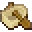</td>
			<td>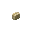</td>
			<td>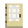</td>
			<td></td>
		</tr>
		<tr>
			<td></td>
			<td></td>
			<td>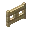</td>
			<td>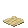</td>
			<td></td>
			<td></td>
		</tr>
		<tr>
			<td colspan="2"></td>
			<td>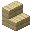</td>
			<td>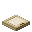</td>
			<td></td>
			<td></td>
		</tr>
	</tablebody>
</table>
<table>
	<tablebody>
		<tr>
			<td></td>
			<td>圖示</td>
			<td>名稱</td>
			<td>標簽</td>
			<td>數量</td>
		</tr>
		<tr>
			<td></td>
			<td></td>
			<td>樺木材</td>
			<td>birch_planks</td>
			<td>1</td>
		</tr>
		<tr>
			<td></td>
			<td></td>
			<td>樺木船</td>
			<td>birch_boat</td>
			<td>1</td>
		</tr>
		<tr>
			<td></td>
			<td></td>
			<td>樺木按鈕</td>
			<td>birch_button</td>
			<td>1</td>
		</tr>
		<tr>
			<td></td>
			<td></td>
			<td>樺木門</td>
			<td>birch_door</td>
			<td>1</td>
		</tr>
		<tr>
			<td></td>
			<td></td>
			<td>樺木柵欄</td>
			<td>birch_fence</td>
			<td>1</td>
		</tr>
		<tr>
			<td></td>
			<td></td>
			<td>樺木柵欄門</td>
			<td>birch_fence_gate</td>
			<td>1</td>
		</tr>
		<tr>
			<td></td>
			<td></td>
			<td>樺木壓力板</td>
			<td>birch_pressure_plate</td>
			<td>1</td>
		</tr>
		<tr>
			<td></td>
			<td></td>
			<td>樺木告示牌</td>
			<td>birch_sign</td>
			<td>1</td>
		</tr>
		<tr>
			<td></td>
			<td></td>
			<td>樺木半磚</td>
			<td>birch_slab</td>
			<td>2</td>
		</tr>
		<tr>
			<td></td>
			<td></td>
			<td>樺木階梯</td>
			<td>birch_stairs</td>
			<td>1</td>
		</tr>
		<tr>
			<td></td>
			<td></td>
			<td>樺木地板門</td>
			<td>birch_trapdoor</td>
			<td>1</td>
		</tr>
	</tablebody>
</table>

---
<!-- dark_oak_trapdoor__from__stonecutting__use__dark_oak_planks.md -->

<!-- zh_tw -->

## 黑橡木地板門 | 切石機 | 黑橡木材

<table>
	<tablebody>
		<tr>
			<td colspan="6">切石機</td>
		</tr>
		<tr>
			<td colspan="2"></td>
			<td>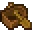</td>
			<td>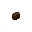</td>
			<td>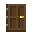</td>
			<td>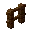</td>
		</tr>
		<tr>
			<td></td>
			<td></td>
			<td></td>
			<td>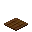</td>
			<td></td>
			<td></td>
		</tr>
		<tr>
			<td colspan="2"></td>
			<td>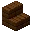</td>
			<td>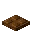</td>
			<td></td>
			<td></td>
		</tr>
	</tablebody>
</table>
<table>
	<tablebody>
		<tr>
			<td></td>
			<td>圖示</td>
			<td>名稱</td>
			<td>標簽</td>
			<td>數量</td>
		</tr>
		<tr>
			<td></td>
			<td></td>
			<td>黑橡木材</td>
			<td>dark_oak_planks</td>
			<td>1</td>
		</tr>
		<tr>
			<td></td>
			<td></td>
			<td>黑橡木船</td>
			<td>dark_oak_boat</td>
			<td>1</td>
		</tr>
		<tr>
			<td></td>
			<td></td>
			<td>黑橡木按鈕</td>
			<td>dark_oak_button</td>
			<td>1</td>
		</tr>
		<tr>
			<td></td>
			<td></td>
			<td>黑橡木門</td>
			<td>dark_oak_door</td>
			<td>1</td>
		</tr>
		<tr>
			<td></td>
			<td></td>
			<td>黑橡木柵欄</td>
			<td>dark_oak_fence</td>
			<td>1</td>
		</tr>
		<tr>
			<td></td>
			<td></td>
			<td>黑橡木柵欄門</td>
			<td>dark_oak_fence_gate</td>
			<td>1</td>
		</tr>
		<tr>
			<td></td>
			<td></td>
			<td>黑橡木壓力板</td>
			<td>dark_oak_pressure_plate</td>
			<td>1</td>
		</tr>
		<tr>
			<td></td>
			<td></td>
			<td>黑橡木告示牌</td>
			<td>dark_oak_sign</td>
			<td>1</td>
		</tr>
		<tr>
			<td></td>
			<td></td>
			<td>黑橡木半磚</td>
			<td>dark_oak_slab</td>
			<td>2</td>
		</tr>
		<tr>
			<td></td>
			<td></td>
			<td>黑橡木階梯</td>
			<td>dark_oak_stairs</td>
			<td>1</td>
		</tr>
		<tr>
			<td></td>
			<td></td>
			<td>黑橡木地板門</td>
			<td>dark_oak_trapdoor</td>
			<td>1</td>
		</tr>
	</tablebody>
</table>

---
<!-- jungle_trapdoor__from__stonecutting__use__jungle_planks.md -->

<!-- zh_tw -->

## 叢林木地板門 | 切石機 | 叢林木材

<table>
	<tablebody>
		<tr>
			<td colspan="6">切石機</td>
		</tr>
		<tr>
			<td colspan="2"></td>
			<td>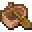</td>
			<td>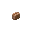</td>
			<td>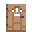</td>
			<td></td>
		</tr>
		<tr>
			<td></td>
			<td></td>
			<td>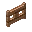</td>
			<td>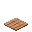</td>
			<td></td>
			<td></td>
		</tr>
		<tr>
			<td colspan="2"></td>
			<td>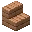</td>
			<td>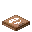</td>
			<td></td>
			<td></td>
		</tr>
	</tablebody>
</table>
<table>
	<tablebody>
		<tr>
			<td></td>
			<td>圖示</td>
			<td>名稱</td>
			<td>標簽</td>
			<td>數量</td>
		</tr>
		<tr>
			<td></td>
			<td></td>
			<td>叢林木材</td>
			<td>jungle_planks</td>
			<td>1</td>
		</tr>
		<tr>
			<td></td>
			<td></td>
			<td>叢林木船</td>
			<td>jungle_boat</td>
			<td>1</td>
		</tr>
		<tr>
			<td></td>
			<td></td>
			<td>叢林木按鈕</td>
			<td>jungle_button</td>
			<td>1</td>
		</tr>
		<tr>
			<td></td>
			<td></td>
			<td>叢林木門</td>
			<td>jungle_door</td>
			<td>1</td>
		</tr>
		<tr>
			<td></td>
			<td></td>
			<td>叢林木柵欄</td>
			<td>jungle_fence</td>
			<td>1</td>
		</tr>
		<tr>
			<td></td>
			<td></td>
			<td>叢林木柵欄門</td>
			<td>jungle_fence_gate</td>
			<td>1</td>
		</tr>
		<tr>
			<td></td>
			<td></td>
			<td>叢林木壓力板</td>
			<td>jungle_pressure_plate</td>
			<td>1</td>
		</tr>
		<tr>
			<td></td>
			<td></td>
			<td>叢林木告示牌</td>
			<td>jungle_sign</td>
			<td>1</td>
		</tr>
		<tr>
			<td></td>
			<td></td>
			<td>叢林木半磚</td>
			<td>jungle_slab</td>
			<td>2</td>
		</tr>
		<tr>
			<td></td>
			<td></td>
			<td>叢林木階梯</td>
			<td>jungle_stairs</td>
			<td>1</td>
		</tr>
		<tr>
			<td></td>
			<td></td>
			<td>叢林木地板門</td>
			<td>jungle_trapdoor</td>
			<td>1</td>
		</tr>
	</tablebody>
</table>

---
<!-- oak_trapdoor__from__stonecutting__use__oak_planks.md -->

<!-- zh_tw -->

## 橡木地板門 | 切石機 | 橡木材

<table>
	<tablebody>
		<tr>
			<td colspan="6">切石機</td>
		</tr>
		<tr>
			<td colspan="2"></td>
			<td>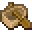</td>
			<td></td>
			<td>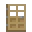</td>
			<td>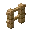</td>
		</tr>
		<tr>
			<td></td>
			<td></td>
			<td>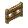</td>
			<td>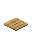</td>
			<td></td>
			<td></td>
		</tr>
		<tr>
			<td colspan="2"></td>
			<td>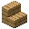</td>
			<td></td>
			<td></td>
			<td></td>
		</tr>
	</tablebody>
</table>
<table>
	<tablebody>
		<tr>
			<td></td>
			<td>圖示</td>
			<td>名稱</td>
			<td>標簽</td>
			<td>數量</td>
		</tr>
		<tr>
			<td></td>
			<td></td>
			<td>橡木材</td>
			<td>oak_planks</td>
			<td>1</td>
		</tr>
		<tr>
			<td></td>
			<td></td>
			<td>橡木船</td>
			<td>oak_boat</td>
			<td>1</td>
		</tr>
		<tr>
			<td></td>
			<td></td>
			<td>橡木按鈕</td>
			<td>oak_button</td>
			<td>1</td>
		</tr>
		<tr>
			<td></td>
			<td></td>
			<td>橡木門</td>
			<td>oak_door</td>
			<td>1</td>
		</tr>
		<tr>
			<td></td>
			<td></td>
			<td>橡木柵欄</td>
			<td>oak_fence</td>
			<td>1</td>
		</tr>
		<tr>
			<td></td>
			<td></td>
			<td>橡木柵欄門</td>
			<td>oak_fence_gate</td>
			<td>1</td>
		</tr>
		<tr>
			<td></td>
			<td></td>
			<td>橡木壓力板</td>
			<td>oak_pressure_plate</td>
			<td>1</td>
		</tr>
		<tr>
			<td></td>
			<td></td>
			<td>橡木告示牌</td>
			<td>oak_sign</td>
			<td>1</td>
		</tr>
		<tr>
			<td></td>
			<td></td>
			<td>橡木半磚</td>
			<td>oak_slab</td>
			<td>2</td>
		</tr>
		<tr>
			<td></td>
			<td></td>
			<td>橡木階梯</td>
			<td>oak_stairs</td>
			<td>1</td>
		</tr>
		<tr>
			<td></td>
			<td></td>
			<td>橡木地板門</td>
			<td>oak_trapdoor</td>
			<td>1</td>
		</tr>
	</tablebody>
</table>

---
<!-- spruce_trapdoor__from__stonecutting__use__spruce_planks.md -->

<!-- zh_tw -->

## 杉木地板門 | 切石機 | 杉木材

<table>
	<tablebody>
		<tr>
			<td colspan="6">切石機</td>
		</tr>
		<tr>
			<td colspan="2"></td>
			<td>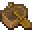</td>
			<td>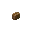</td>
			<td>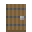</td>
			<td>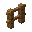</td>
		</tr>
		<tr>
			<td></td>
			<td></td>
			<td>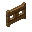</td>
			<td>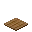</td>
			<td></td>
			<td></td>
		</tr>
		<tr>
			<td colspan="2"></td>
			<td>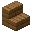</td>
			<td>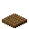</td>
			<td></td>
			<td></td>
		</tr>
	</tablebody>
</table>
<table>
	<tablebody>
		<tr>
			<td></td>
			<td>圖示</td>
			<td>名稱</td>
			<td>標簽</td>
			<td>數量</td>
		</tr>
		<tr>
			<td></td>
			<td></td>
			<td>杉木材</td>
			<td>spruce_planks</td>
			<td>1</td>
		</tr>
		<tr>
			<td></td>
			<td></td>
			<td>杉木船</td>
			<td>spruce_boat</td>
			<td>1</td>
		</tr>
		<tr>
			<td></td>
			<td></td>
			<td>杉木按鈕</td>
			<td>spruce_button</td>
			<td>1</td>
		</tr>
		<tr>
			<td></td>
			<td></td>
			<td>杉木門</td>
			<td>spruce_door</td>
			<td>1</td>
		</tr>
		<tr>
			<td></td>
			<td></td>
			<td>杉木柵欄</td>
			<td>spruce_fence</td>
			<td>1</td>
		</tr>
		<tr>
			<td></td>
			<td></td>
			<td>杉木柵欄門</td>
			<td>spruce_fence_gate</td>
			<td>1</td>
		</tr>
		<tr>
			<td></td>
			<td></td>
			<td>杉木壓力板</td>
			<td>spruce_pressure_plate</td>
			<td>1</td>
		</tr>
		<tr>
			<td></td>
			<td></td>
			<td>杉木告示牌</td>
			<td>spruce_sign</td>
			<td>1</td>
		</tr>
		<tr>
			<td></td>
			<td></td>
			<td>杉木半磚</td>
			<td>spruce_slab</td>
			<td>2</td>
		</tr>
		<tr>
			<td></td>
			<td></td>
			<td>杉木階梯</td>
			<td>spruce_stairs</td>
			<td>1</td>
		</tr>
		<tr>
			<td></td>
			<td></td>
			<td>杉木地板門</td>
			<td>spruce_trapdoor</td>
			<td>1</td>
		</tr>
	</tablebody>
</table>

---
<!-- crimson_trapdoor__from__stonecutting__use__crimson_planks.md -->

<!-- zh_tw -->

## 緋紅蕈木地板門 | 切石機 | 緋紅蕈木材

<table>
	<tablebody>
		<tr>
			<td colspan="6">切石機</td>
		</tr>
		<tr>
			<td colspan="2"></td>
			<td></td>
			<td></td>
			<td>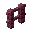</td>
			<td>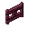</td>
		</tr>
		<tr>
			<td></td>
			<td></td>
			<td></td>
			<td></td>
			<td></td>
			<td>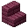</td>
		</tr>
		<tr>
			<td colspan="2"></td>
			<td>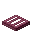</td>
			<td></td>
			<td></td>
			<td></td>
		</tr>
	</tablebody>
</table>
<table>
	<tablebody>
		<tr>
			<td></td>
			<td>圖示</td>
			<td>名稱</td>
			<td>標簽</td>
			<td>數量</td>
		</tr>
		<tr>
			<td></td>
			<td></td>
			<td>緋紅蕈木材</td>
			<td>crimson_planks</td>
			<td>1</td>
		</tr>
		<tr>
			<td></td>
			<td></td>
			<td>緋紅蕈木按鈕</td>
			<td>crimson_button</td>
			<td>1</td>
		</tr>
		<tr>
			<td></td>
			<td></td>
			<td>緋紅蕈木門</td>
			<td>crimson_door</td>
			<td>1</td>
		</tr>
		<tr>
			<td></td>
			<td></td>
			<td>緋紅蕈木柵欄</td>
			<td>crimson_fence</td>
			<td>1</td>
		</tr>
		<tr>
			<td></td>
			<td></td>
			<td>緋紅蕈木柵欄門</td>
			<td>crimson_fence_gate</td>
			<td>1</td>
		</tr>
		<tr>
			<td></td>
			<td></td>
			<td>緋紅蕈木壓力板</td>
			<td>crimson_pressure_plate</td>
			<td>1</td>
		</tr>
		<tr>
			<td></td>
			<td></td>
			<td>緋紅蕈木告示牌</td>
			<td>crimson_sign</td>
			<td>1</td>
		</tr>
		<tr>
			<td></td>
			<td></td>
			<td>緋紅蕈木半磚</td>
			<td>crimson_slab</td>
			<td>2</td>
		</tr>
		<tr>
			<td></td>
			<td></td>
			<td>緋紅蕈木階梯</td>
			<td>crimson_stairs</td>
			<td>1</td>
		</tr>
		<tr>
			<td></td>
			<td></td>
			<td>緋紅蕈木地板門</td>
			<td>crimson_trapdoor</td>
			<td>1</td>
		</tr>
	</tablebody>
</table>

---
<!-- warped_trapdoor__from__stonecutting__use__warped_planks.md -->

<!-- zh_tw -->

## 扭曲蕈木地板門 | 切石機 | 扭曲蕈木材

<table>
	<tablebody>
		<tr>
			<td colspan="6">切石機</td>
		</tr>
		<tr>
			<td colspan="2"></td>
			<td></td>
			<td>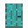</td>
			<td>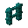</td>
			<td>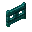</td>
		</tr>
		<tr>
			<td>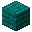</td>
			<td></td>
			<td>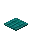</td>
			<td></td>
			<td></td>
			<td></td>
		</tr>
		<tr>
			<td colspan="2"></td>
			<td></td>
			<td></td>
			<td></td>
			<td></td>
		</tr>
	</tablebody>
</table>
<table>
	<tablebody>
		<tr>
			<td></td>
			<td>圖示</td>
			<td>名稱</td>
			<td>標簽</td>
			<td>數量</td>
		</tr>
		<tr>
			<td></td>
			<td></td>
			<td>扭曲蕈木材</td>
			<td>warped_planks</td>
			<td>1</td>
		</tr>
		<tr>
			<td></td>
			<td></td>
			<td>扭曲蕈木按鈕</td>
			<td>warped_button</td>
			<td>1</td>
		</tr>
		<tr>
			<td></td>
			<td></td>
			<td>扭曲蕈木門</td>
			<td>warped_door</td>
			<td>1</td>
		</tr>
		<tr>
			<td></td>
			<td></td>
			<td>扭曲蕈木柵欄</td>
			<td>warped_fence</td>
			<td>1</td>
		</tr>
		<tr>
			<td></td>
			<td></td>
			<td>扭曲蕈木柵欄門</td>
			<td>warped_fence_gate</td>
			<td>1</td>
		</tr>
		<tr>
			<td></td>
			<td></td>
			<td>扭曲蕈木壓力板</td>
			<td>warped_pressure_plate</td>
			<td>1</td>
		</tr>
		<tr>
			<td></td>
			<td></td>
			<td>扭曲蕈木告示牌</td>
			<td>warped_sign</td>
			<td>1</td>
		</tr>
		<tr>
			<td></td>
			<td></td>
			<td>扭曲蕈木半磚</td>
			<td>warped_slab</td>
			<td>2</td>
		</tr>
		<tr>
			<td></td>
			<td></td>
			<td>扭曲蕈木階梯</td>
			<td>warped_stairs</td>
			<td>1</td>
		</tr>
		<tr>
			<td></td>
			<td></td>
			<td>扭曲蕈木地板門</td>
			<td>warped_trapdoor</td>
			<td>1</td>
		</tr>
	</tablebody>
</table>

