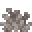

<table>
	<tablebody>
		<tr>
			<td>圖示</td>
			<td>名稱</td>
			<td>標簽</td>
		</tr>
		<tr>
			<td></td>
			<td>死亡的腦珊瑚</td>
			<td>dead_brain_coral</td>
		</tr>
		<tr>
			<td></td>
			<td>死亡的氣泡珊瑚</td>
			<td>dead_bubble_coral</td>
		</tr>
		<tr>
			<td></td>
			<td>死亡的火珊瑚</td>
			<td>dead_fire_coral</td>
		</tr>
		<tr>
			<td></td>
			<td>死亡的角珊瑚</td>
			<td>dead_horn_coral</td>
		</tr>
		<tr>
			<td></td>
			<td>死亡的管珊瑚</td>
			<td>dead_tube_coral</td>
		</tr>
	</tablebody>
</table>