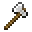
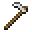
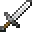
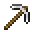
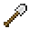
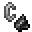

<table>
	<tablebody>
		<tr>
			<td>圖示</td>
			<td>名稱</td>
			<td>標簽</td>
		</tr>
		<tr>
			<td></td>
			<td>鐵斧</td>
			<td>iron_axe</td>
		</tr>
		<tr>
			<td></td>
			<td>鐵鋤</td>
			<td>iron_hoe</td>
		</tr>
		<tr>
			<td></td>
			<td>鐵劍</td>
			<td>iron_sword</td>
		</tr>
		<tr>
			<td></td>
			<td>鐵鎬</td>
			<td>iron_pickaxe</td>
		</tr>
		<tr>
			<td></td>
			<td>鐵鏟</td>
			<td>iron_shovel</td>
		</tr>
		<tr>
			<td></td>
			<td>打火石</td>
			<td>flint_and_steel</td>
		</tr>
		<tr>
			<td></td>
			<td>剪刀</td>
			<td>shears</td>
		</tr>
	</tablebody>
</table>