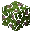

<table>
	<tablebody>
		<tr>
			<td>圖示</td>
			<td>名稱</td>
			<td>標簽</td>
		</tr>
		<tr>
			<td></td>
			<td>橡木樹葉</td>
			<td>oak_leaves</td>
		</tr>
		<tr>
			<td></td>
			<td>黑橡木樹葉</td>
			<td>dark_oak_leaves</td>
		</tr>
		<tr>
			<td></td>
			<td>樺木樹葉</td>
			<td>birch_leaves</td>
		</tr>
		<tr>
			<td></td>
			<td>叢林木樹葉</td>
			<td>jungle_leaves</td>
		</tr>
		<tr>
			<td></td>
			<td>相思木樹葉</td>
			<td>acacia_leaves</td>
		</tr>
		<tr>
			<td></td>
			<td>杜鵑葉</td>
			<td>azalea_leaves</td>
		</tr>
		<tr>
			<td></td>
			<td>開花的杜鵑葉</td>
			<td>flowering_azalea_leaves</td>
		</tr>
		<tr>
			<td></td>
			<td>杉木樹葉</td>
			<td>spruce_leaves</td>
		</tr>
	</tablebody>
</table>