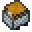
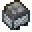

<table>
	<tablebody>
		<tr>
			<td>圖示</td>
			<td>名稱</td>
			<td>標簽</td>
		</tr>
		<tr>
			<td></td>
			<td>礦車</td>
			<td>minecart</td>
		</tr>
		<tr>
			<td></td>
			<td>TNT 礦車</td>
			<td>tnt_minecart</td>
		</tr>
		<tr>
			<td></td>
			<td>儲物箱礦車</td>
			<td>chest_minecart</td>
		</tr>
		<tr>
			<td></td>
			<td>熔爐礦車</td>
			<td>furnace_minecart</td>
		</tr>
	</tablebody>
</table>