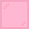
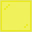

<table>
	<tablebody>
		<tr>
			<td>圖示</td>
			<td>名稱</td>
			<td>標簽</td>
		</tr>
		<tr>
			<td></td>
			<td>紅色玻璃片</td>
			<td>red_stained_glass_pane</td>
		</tr>
		<tr>
			<td></td>
			<td>藍色玻璃片</td>
			<td>blue_stained_glass_pane</td>
		</tr>
		<tr>
			<td></td>
			<td>青色玻璃片</td>
			<td>cyan_stained_glass_pane</td>
		</tr>
		<tr>
			<td></td>
			<td>灰色玻璃片</td>
			<td>gray_stained_glass_pane</td>
		</tr>
		<tr>
			<td></td>
			<td>淺綠色玻璃片</td>
			<td>lime_stained_glass_pane</td>
		</tr>
		<tr>
			<td></td>
			<td>粉紅色玻璃片</td>
			<td>pink_stained_glass_pane</td>
		</tr>
		<tr>
			<td></td>
			<td>黑色玻璃片</td>
			<td>black_stained_glass_pane</td>
		</tr>
		<tr>
			<td></td>
			<td>棕色玻璃片</td>
			<td>brown_stained_glass_pane</td>
		</tr>
		<tr>
			<td></td>
			<td>綠色玻璃片</td>
			<td>green_stained_glass_pane</td>
		</tr>
		<tr>
			<td></td>
			<td>白色玻璃片</td>
			<td>white_stained_glass_pane</td>
		</tr>
		<tr>
			<td></td>
			<td>橙色玻璃片</td>
			<td>orange_stained_glass_pane</td>
		</tr>
		<tr>
			<td></td>
			<td>紫色玻璃片</td>
			<td>purple_stained_glass_pane</td>
		</tr>
		<tr>
			<td></td>
			<td>黃色玻璃片</td>
			<td>yellow_stained_glass_pane</td>
		</tr>
		<tr>
			<td></td>
			<td>洋紅色玻璃片</td>
			<td>magenta_stained_glass_pane</td>
		</tr>
		<tr>
			<td></td>
			<td>淺藍色玻璃片</td>
			<td>light_blue_stained_glass_pane</td>
		</tr>
		<tr>
			<td></td>
			<td>淺灰色玻璃片</td>
			<td>light_gray_stained_glass_pane</td>
		</tr>
	</tablebody>
</table>