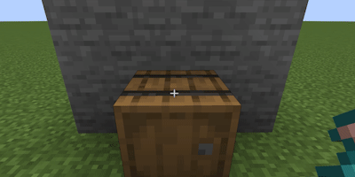

## 茶爐：

### 用法

小·茶爐

[//]: # ()

大·茶爐

[//]: # ()

* 步驟
  * 將一本書放到容器中第一格
  * 將一個消耗品扔在容器上方
  * 玩家必須距離消耗品5格之內

[茶方](/zh_tw/tea_room/tea_recipe.md)

### 容器

<table>
	<tablebody>
		<tr>
			<td>容器</td>
			<td>容器 ID</td>
			<td>物品位置</td>
		</tr>
		<tr>
            <td>木桶</td>
			<td>barrel</td>
			<td rowspan="4"></td>
		</tr>
		<tr>
            <td>界伏盒</td>
			<td>shulker_box</td>
		</tr>
		<tr>
            <td>儲物箱</td>
			<td>chest</td>
		</tr>
		<tr>
            <td>陷阱儲物箱</td>
			<td>trapped_chest</td>
		</tr>
		<tr>
            <td>大型儲物箱</td>
			<td>large_chest</td>
			<td></td>
		</tr>
		<tr>
            <td>漏斗</td>
			<td>hopper</td>
			<td></td>
		</tr>
		<tr>
            <td>投擲器</td>
			<td>dropper</td>
			<td rowspan="2"></td>
		</tr>
		<tr>
            <td>發射器</td>
			<td>dispenser</td>
		</tr>
		<tr>
            <td>熔爐</td>
			<td>furnace</td>
			<td rowspan="3"></td>
		</tr>
		<tr>
            <td>高爐</td>
			<td>blast_furnace</td>
		</tr>
		<tr>
            <td>煙燻爐</td>
			<td>smoker</td>
		</tr>
	</tablebody>
</table>

### 提示

* 檢測空間順序
  * 首先檢測消耗品所在方塊內的容器，如箱子、漏斗等不完整方塊。
  * 然後檢查消耗品下方方塊內的容器，如木桶、潛影盒等完整方塊。

* 檢測時間順序
  * 每間隔20ticks檢測一次，對不同物品的檢測是錯峰的。