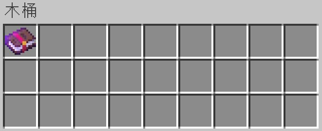
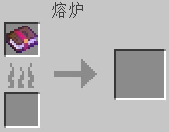
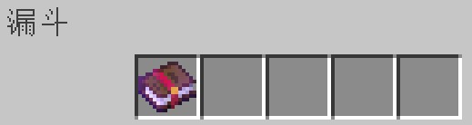

# 使用煉金術

## 方法

1. 放置一個容器，作為煉金爐使用。\
   可用的不完整方塊有：儲物箱、陷阱儲物箱、漏斗\
   可用的完整方塊有：木桶、界伏盒、投擲器、發射器、熔爐、高爐、煙熏爐
2. 打開容器交互介面，將要改變的目標物品放入到容器介面左上角第一個欄位中。
3. 關閉容器介面，將一個消耗品按Q鍵扔出（而不是按“右鍵”使用）到容器上方，直到它靜止掉落在容器方塊上（漏斗需要被充能，使漏斗無法吸入和漏出物品）。
4. 確保玩家距離消耗品5米（格）之內，程式將檢測消耗品所在方塊的容器中的第一個物品，如果該物品與煉金配方中所需求的物品匹配，則煉化這個物品，並消耗掉消耗品。\
   如果消耗品仍然存在，則檢測其下方一格的容器中的第一個物品，如果該物品與煉金配方中所需求的物品匹配，則煉化這個物品，並消耗掉消耗品。
5. 再次打開煉金爐，取出成品。


消耗品掉落在容器上表面時：

如果容器是不完整方塊，容器與消耗品的位置都在同一個方塊範圍內；

如果容器是完整方塊時，容器位置在消耗品下方一格。


## 目標物品擺放位置：

   

## 消耗品擺放位置：

 

## 煉金爐造型參考：


v0.08添加炼金术功能

